# Analisi del corpus

## Composizione del corpus

Il corpus è composto da 200 documenti distribuiti su 12 discipline, con una distribuzione molto sbilanciata: SCSA_Bon domina con 52 documenti (26% del totale), seguita da CILE_Pol (35) e CPH_Mor (31), mentre DEIC_San è rappresentata da un unico documento. Questa asimmetria è rilevante per l'interpretazione delle metriche di similarità, poiché le discipline con più testi tendono a offrire profili lessicali più stabili e rappresentativi.

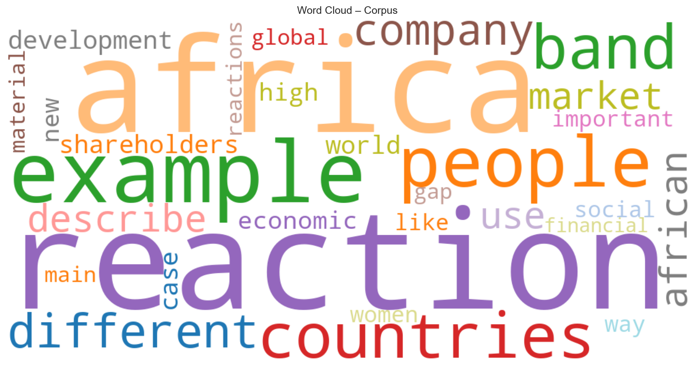

*La word cloud visualizza la distribuzione frequenziale del vocabolario complessivo. Emergono con chiarezza due poli lessicali: quello scientifico, dominato da* reaction *e* band*, e quello socio-geopolitico, con* africa*,* people*,* countries*,* company *e* market*. La co-presenza di questi due poli riflette la struttura biforcata del corpus: un sottocorpus di chimica dei materiali e fisica dei semiconduttori (SCSA_Bon, CPH_Mor) e uno di scienze sociali, economia e diritto (AS_Gus, CILE_Pol, CLA_Pol, GLD_Gog). La presenza di* example *e* describe *indica il registro argomentativo-espositivo dei testi.*

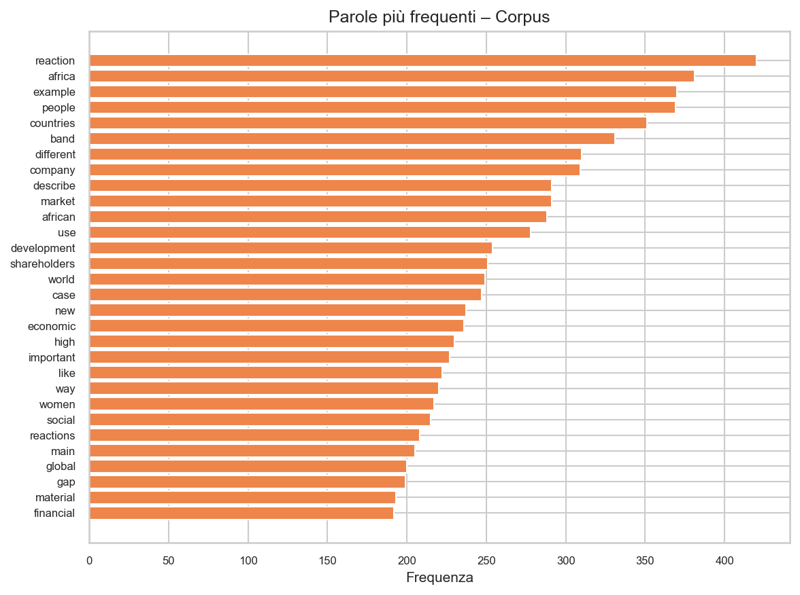

*Il grafico a barre conferma la gerarchia frequenziale della word cloud. In prima posizione troviamo* reaction *(~420 occorrenze), seguita da* africa*,* example*,* people*,* countries*,* band*. La lista mescola termini scientifici (*reaction*,* band*,* gap*,* material*,* reactions*,* energy*) e socio-economici (*africa*,* people*,* countries*,* company*,* market*,* shareholders*), rispecchiando la composizione duale del corpus. La frequenza relativamente alta di* example *è coerente con un corpus di produzioni scritte studentesche in cui l'esemplificazione è una strategia argomentativa ricorrente.*

## Similarità tra discipline

Sono state utilizzate due metriche complementari: cosine similarity su vettori TF-IDF (bag-of-words) e similarità su embeddings prodotti da spaCy. I due approcci catturano aspetti diversi della prossimità testuale.

### Similarità cosine (TF-IDF)

I valori sono generalmente bassi (tra 0.06 e 0.39), il che indica che le discipline si differenziano lessicalmente in modo abbastanza netto. I picchi più alti si registrano tra:

- **AS_Gus ↔ CPH_Mor** (0.392): la coppia più simile dell'intero corpus. AS_Gus (studi africani) e CPH_Mor (storia economica coloniale) condividono un registro accademico-umanistico che include vocabolario di scienze sociali, storia e politica globale — un'area semantica sufficientemente ampia da produrre una similarità cosine non banale pur in assenza di sovrapposizioni tematiche dirette.
- **CILE_Pol ↔ CLA_Pol** (0.369): alta prossimità attesa, trattandosi probabilmente di due varianti disciplinari affini nell'area giuridica o politico-istituzionale.
- **AS_Gus ↔ GLD_Gog** (0.356) e **AS_Gus ↔ EOK_Geu** (0.349): AS_Gus risulta il nodo più connesso del grafo di similarità, con legami significativi verso molteplici discipline.

Le coppie meno simili coinvolgono quasi sempre DEIC_San, ELClass_Zot ed ELSPS_Zot, discipline che sembrano lessicalmente più isolate. In particolare, DEIC_San è rappresentata da un solo documento, il che limita qualsiasi generalizzazione.

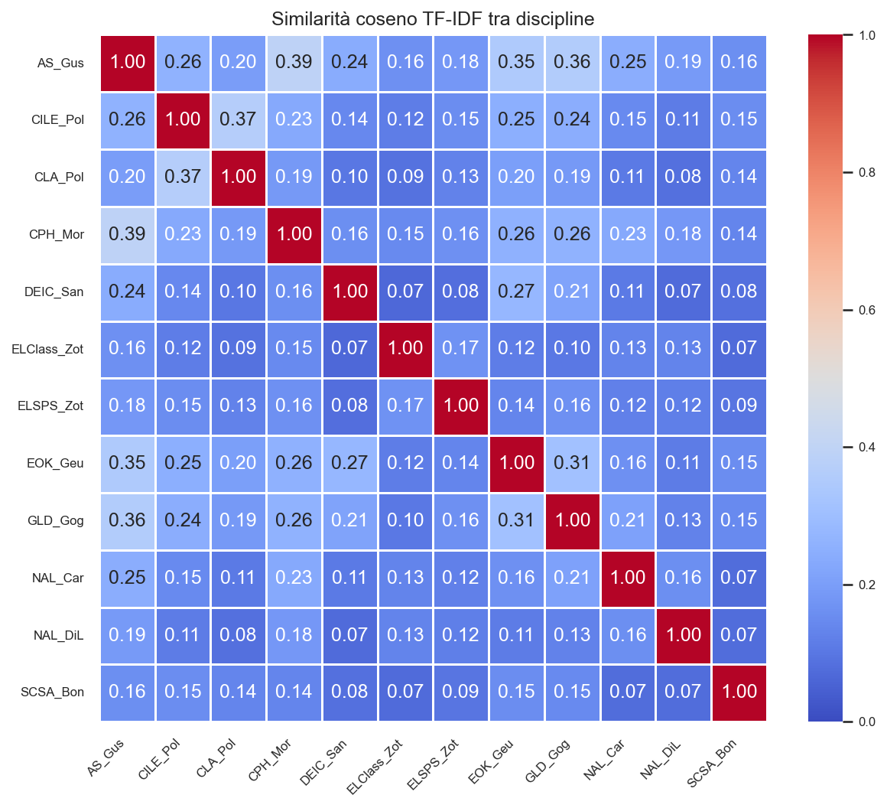

*La heatmap rende visivamente immediato ciò che le cifre descrivono: la matrice è prevalentemente fredda (valori bassi), con alcune celle calde che spiccano. Le diagonali locali segnalano la presenza di cluster: AS_Gus, CPH_Mor e GLD_Gog formano un'area calda nella parte alta della matrice, mentre CILE_Pol e CLA_Pol si toccano nell'angolo superiore sinistro. DEIC_San, ELClass_Zot ed ELSPS_Zot appaiono come righe e colonne quasi uniformemente fredde, confermando il loro isolamento lessicale rispetto al resto del corpus.*

### Similarità da embeddings (spaCy)

I valori sono tutti molto alti (tra 0.87 e 0.99), con una compressione che rende le differenze numericamente piccole ma comunque interpretabili in senso relativo. Gli embeddings catturano somiglianze semantiche di alto livello, livellando differenze terminologiche di superficie. Anche qui AS_Gus si conferma disciplina centrale, con valori vicini a 1.00 verso GLD_Gog (0.991) e EOK_Geu (0.985). Le coppie con punteggi più bassi negli embeddings — come DEIC_San ↔ ELClass_Zot (0.880) e DEIC_San ↔ ELSPS_Zot (0.883) — corrispondono alle stesse coppie distanti nella metrica cosine, suggerendo coerenza tra i due approcci nei casi estremi.

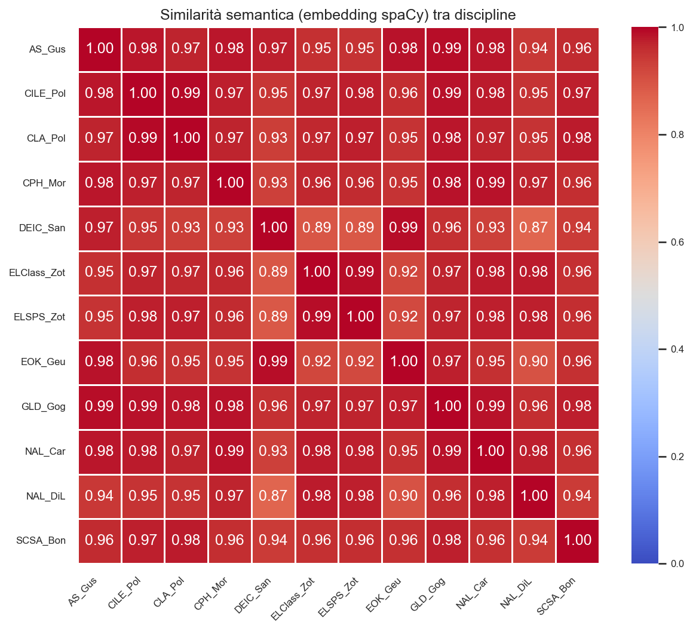

*La heatmap degli embeddings mostra una matrice quasi interamente calda, con variazioni molto compresse nell'intervallo 0.87–0.99. Questo effetto di compressione è una caratteristica nota degli spazi vettoriali ad alta dimensione, dove le distanze angolari tra rappresentazioni semantiche ricche tendono a convergere verso valori alti anche in presenza di differenze tematiche reali. Le celle più fredde — DEIC_San verso quasi tutti, e NAL_Car — corrispondono ai corpus più piccoli: la scarsità di dati penalizza la costruzione di profili semantici stabili e distinti.*

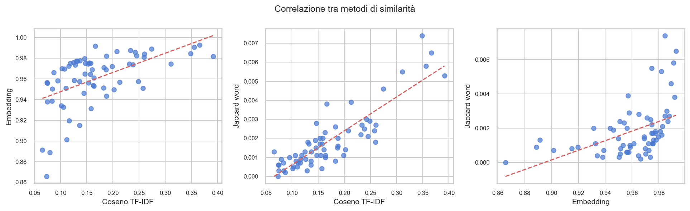

*Il pannello triplo mostra la correlazione tra le tre metriche di similarità: Coseno TF-IDF, embedding spaCy e Jaccard sui bigrammi. Il pannello sinistro (Coseno vs. Embedding) evidenzia una correlazione positiva ma debole e con notevole dispersione: i due metodi catturano aspetti complementari, non sovrapponibili. Il pannello centrale (Coseno vs. Jaccard-word) mostra una correlazione più stretta, attesa perché entrambi operano su forme lessicali di superficie. Il pannello destro (Embedding vs. Jaccard-word) è il più disperso: la misura semantica profonda e quella lessicale di superficie sono le più ortogonali, confermando che il lessico condiviso non implica prossimità semantica e viceversa.*

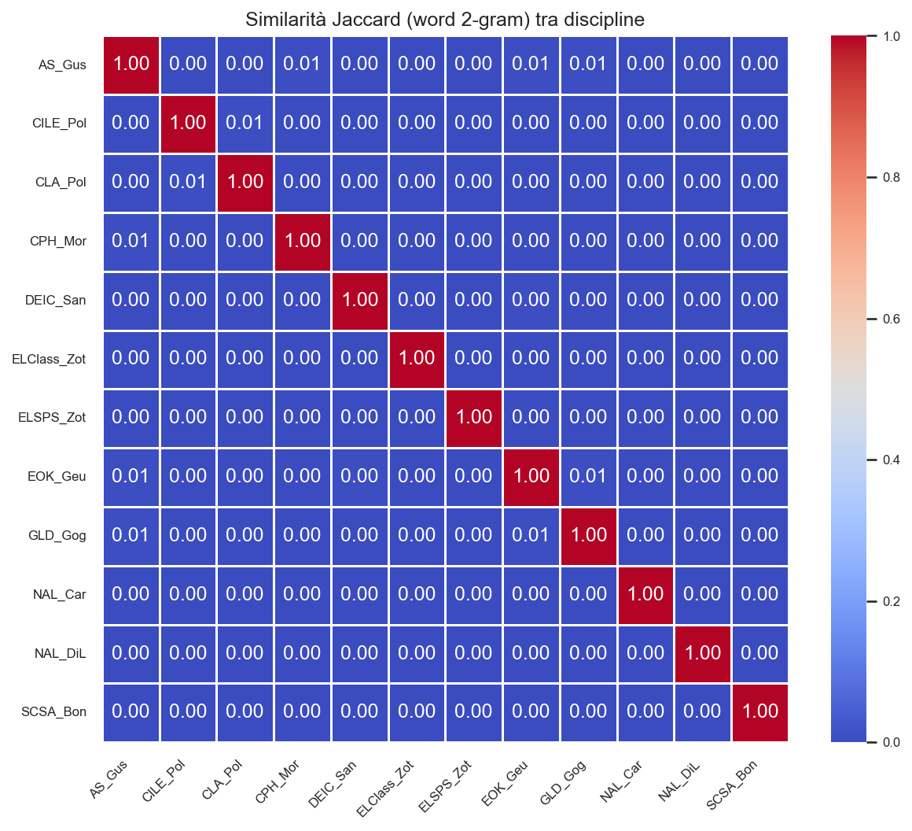

*La heatmap Jaccard sui bigrammi (word 2-gram) mostra valori quasi ovunque pari a zero, con rarissime eccezioni. Questo risultato estremo rivela che le discipline non condividono praticamente alcun bigramma lessicale: la specializzazione terminologica è così marcata che anche coppie disciplinarmente affini come CILE_Pol e CLA_Pol non presentano bigrammi comuni significativi. La metrica Jaccard sui bigrammi è pertanto la più discriminante e la più sensibile alla specificità terminologica del corpus.*

## Frequenze e keywords del corpus

Le parole più frequenti rivelano la natura composita del corpus. Emergono due aree tematiche distinte: una scientifica (*reaction*, *band*, *gap*, *energy*, *material*, in linea con il Topic 6 del LDA) e una socio-economico-giuridica (*africa*, *people*, *countries*, *company*, *market*, *shareholders*, corrispondenti ai Topic 2, 7 e 3). I bigrammi confermano questa lettura: *band gap*, *metal semiconductor*, *graphic representation* indicano tematiche di fisica dei materiali e chimica; *dominant position*, *corporate law*, *external constituencies* puntano verso il diritto societario e commerciale; *sci hub* e *south africa* appartengono rispettivamente all'economia della ricerca (EOK_Geu) e agli studi africani (AS_Gus, GLD_Gog).

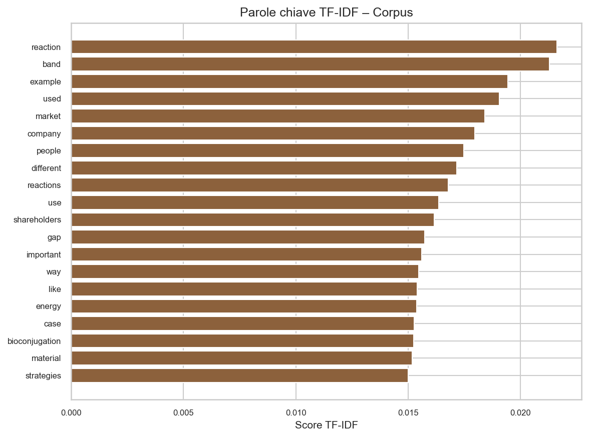

*Le keyword TF-IDF mostrano una polarizzazione netta tra i due sottocorpus.* Reaction *e* band *guidano la lista con i punteggi più alti, riflettendo la dominanza quantitativa di SCSA_Bon nel corpus. A seguire,* example*,* used*,* market*,* company*,* people *e* shareholders *rappresentano il polo socio-giuridico. La compresenza di termini scientifici specifici come* bioconjugation *e* gap *accanto a termini giuridici come* shareholders *e* market *conferma che le due aree tematiche sono lessicalmente ben separate e nessuna delle due dilaga nell'altra.*

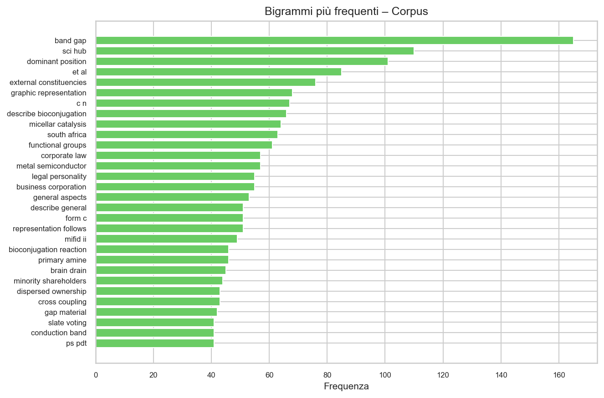

*I bigrammi catturano co-occorrenze significative e rivelano la struttura interna di ciascuna nicchia disciplinare.* Band gap *domina nettamente (~140 occorrenze), isolando la fisica dei semiconduttori come sottocorpus compatto e terminologicamente omogeneo. Seguono* sci hub *(EOK_Geu),* dominant position *e* external constituencies *(CILE_Pol),* graphic representation *e* describe bioconjugation *(SCSA_Bon),* south africa *(AS_Gus/GLD_Gog),* corporate law*,* metal semiconductor *e* business corporation*. La distribuzione a coda lunga conferma che il lessico specializzato si concentra in cluster disciplinari ben definiti, con scarso overlap tra aree.*

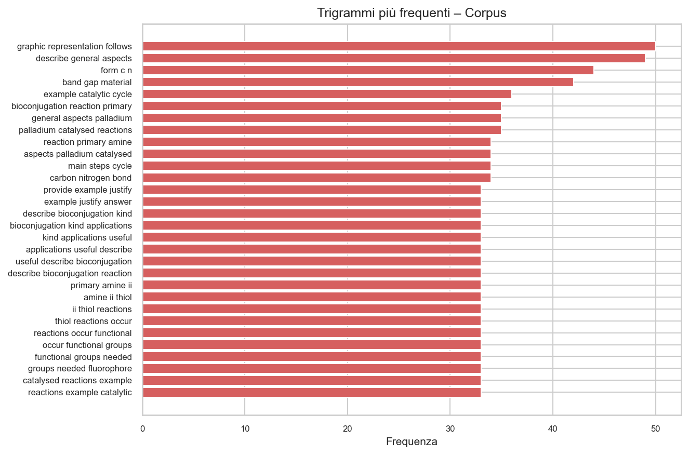

*I trigrammi rivelano la struttura interna delle specializzazioni disciplinari. Il trigramma di testa,* graphic representation follows*, è un'espressione formulaica ricorrente in SCSA_Bon per introdurre figure o schemi chimici. Seguono* band gap material*,* form c n *(riferito a legami carbonio-azoto), e una serie di trigrammi chimici — *general aspects palladium*,* bioconjugation aspects palladium*,* reaction primary amine*,* catalytic cycle reaction *— che confermano la specializzazione di SCSA_Bon nella chimica bioconjugativa con catalisi al palladio. I trigrammi come* describe bioconjugation kind *e* bioconjugation applications useful *riflettono il registro espositivo-definitorio tipico delle produzioni scritte esaminate.*

## Topic modeling (LDA)

Gli 8 topic estratti mostrano una struttura coerente con la distribuzione disciplinare, pur con alcune sovrapposizioni attese:

- **Topic 0** (example, model, person, describe, discourse, persuasion, answer) corrisponde alle discipline ELClass_Zot ed ELSPS_Zot, centrate sull'analisi del discorso e l'argomentazione retorica.
- **Topic 2** (company, shareholder, market, strategy, price, financial, share, firm) e **Topic 3** (development, industry, university, innovation, NGOs, research, informal, government) coprono rispettivamente il diritto societario-finanziario (CILE_Pol, CLA_Pol) e l'economia dello sviluppo (GLD_Gog, EOK_Geu, DEIC_San).
- **Topic 4** (country, migration, brain drain, skilled, modernity, native) isola con precisione EOK_Geu nel sottotema della migrazione qualificata e del brain drain.
- **Topic 6** (reaction, band, material, polymer, gap, catalyst, energy, bioconjugation) è il topic scientifico per eccellenza, riconducibile a SCSA_Bon e alla componente chimica di CPH_Mor.
- **Topic 7** (africa, country, african, people, food, global, globalization) e **Topic 1** (woman, hub, sci, access, india, education, british, colonial) coprono rispettivamente AS_Gus/GLD_Gog e un'area mista tra EOK_Geu e CPH_Mor (storia coloniale, accesso alla conoscenza).
- **Topic 5** (development, country, passage, investment, africa, life) appare il più eterogeneo, con tracce di NAL_DiL (*passage*) e AS_Gus, suggerendo una parziale contaminazione tra letteratura afroamericana e studi africani.

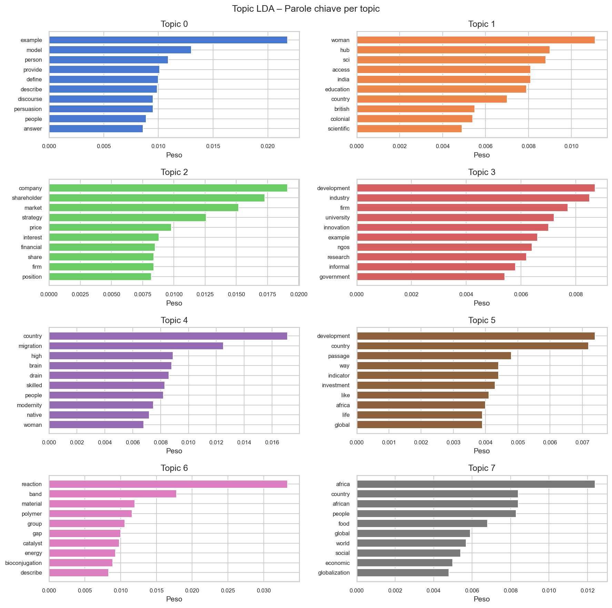

*La visualizzazione dei topic LDA mostra una struttura tematica ben differenziata. T6 (reaction, band, material, polymer, gap, catalyst, energy, bioconjugation) è il topic scientifico per eccellenza — compatto e terminologicamente omogeneo. T0 (example, model, person, describe, discourse, persuasion) cattura con precisione le discipline di analisi del discorso (ELClass_Zot, ELSPS_Zot). T2 (company, shareholder, market, strategy, financial, firm) e T3 (development, industry, university, innovation, NGOs, research) separano il diritto societario dall'economia dello sviluppo. T7 (africa, country, african, people, food, global, globalization) e T1 (woman, hub, sci, access, india, education, british, colonial) rappresentano rispettivamente gli studi africani e un'area mista tra storia coloniale e accesso alla conoscenza scientifica. T4 (country, migration, brain drain, skilled) isola con precisione il tema della migrazione qualificata (EOK_Geu).*

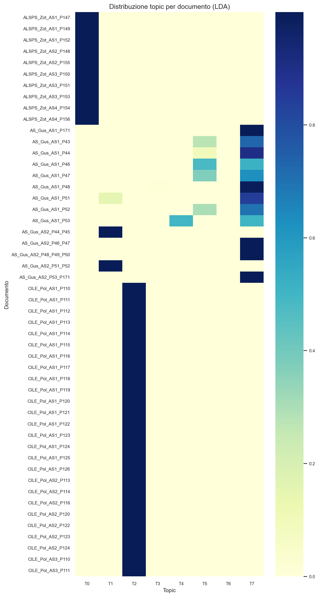

*La heatmap documento×topic mostra pattern di assegnazione netti: la maggior parte dei documenti è dominata da un singolo topic, con rare eccezioni miste. I documenti ELSPS_Zot (in cima) mostrano un'assegnazione quasi esclusiva al T0 (discourse, persuasion), confermando la compattezza tematica di questa disciplina. I documenti AS_Gus mostrano variazione interna tra T7 (Africa, globalizzazione) e T5, riflettendo l'eterogeneità tematica della disciplina. I documenti SCSA_Bon si concentrano su T6 (chimica/materiali) con la distribuzione più compatta del corpus, coerente con la natura altamente specializzata di questa disciplina.*

---

## Morfologia, sintassi e formule accademiche del corpus

Questa sezione integra le analisi di morfologia, distribuzione sintattica e uso delle formule accademiche a livello di corpus complessivo, come complemento alle analisi per disciplina presentate nella sezione successiva.

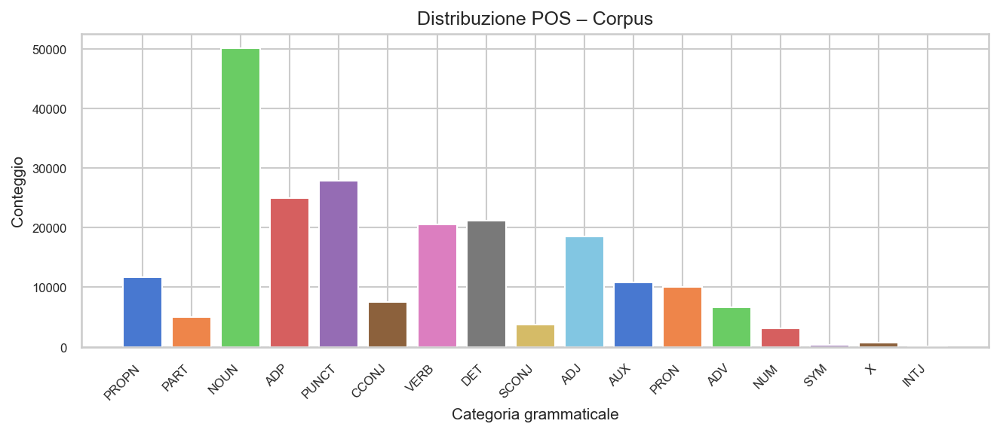

*La distribuzione delle parti del discorso a livello di corpus rivela la fisionomia grammaticale complessiva del corpus. I NOUN dominano nettamente (~51.000 occorrenze), seguiti da PUNCT e ADP — indici di un discorso altamente nominalizzato, con strutture preposizionali dense tipiche della scrittura accademica. VERB e DET si equivalgono intorno a 21.000 occorrenze. La quasi assenza di INTJ e la scarsità di SYM confermano la natura scritta e formale dei testi. La quota relativamente contenuta di ADV (~6.500) è coerente con uno stile che preferisce la modulazione attraverso aggettivi e costruzioni nominali piuttosto che avverbi.*

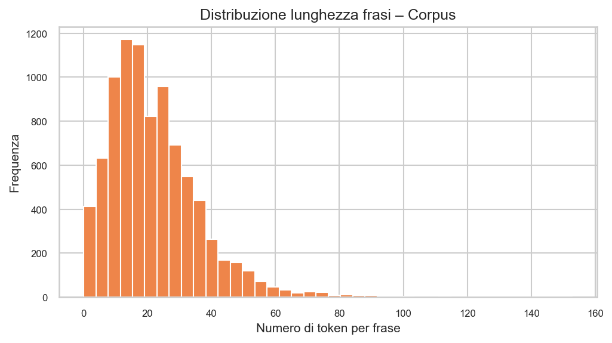

*La distribuzione della lunghezza delle frasi mostra una forma asimmetrica positiva tipica dei testi accademici: la moda si colloca intorno a 15–20 token, con una coda destra che si estende fino a 100+ token. La piccola ma visibile frequenza nella fascia 0–5 token è probabilmente riconducibile a frasi incomplete, titoli o frammenti di risposta. La coda lunga (frasi >60 token) indica la presenza di costruzioni subordinate complesse, coerenti con lo stile accademico delle discipline con maggiore profondità sintattica (GLD_Gog, AS_Gus, NAL_Car). La concentrazione della distribuzione sotto i 40 token riflette invece il profilo delle discipline scientifiche e di quelle con risposte più frammentarie.*

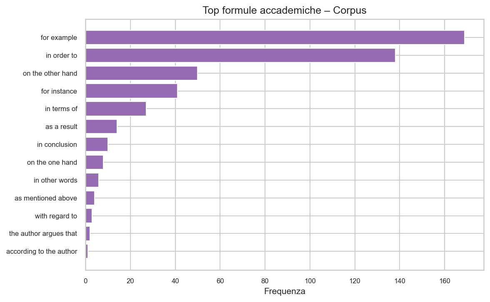

*Il grafico delle formule accademiche mostra che* for example *(>165 occorrenze) e* in order to *(~138) dominano con un divario netto sulle altre formule. Questo pattern segnala un repertorio retorico polarizzato: l'esemplificazione e la finalità sono le strategie di coesione più diffuse nell'intero corpus, a scapito di formule più sofisticate come la concessione (*on the other hand*: ~50) o la sintesi (*in conclusion*: ~10). La quasi assenza di* according to the author *e* the author argues that *conferma che il corpus non è composto da saggi argomentativi maturi, bensì da risposte a domande con struttura predefinita, dove il rapporto dialogico con la letteratura secondaria è raro o assente.*

---

## Analisi per disciplina

### Nota metodologica preliminare

Prima di esaminare le singole discipline, è utile fissare alcune coordinate interpretative valide per l'intero set di dati per disciplina. I profili che emergono sono costruiti incrociando sei dimensioni: vocabolario distintivo (TF-IDF), frequenze lessicali, morfologia (TTR, POS distribution), struttura sintattica (lunghezza delle frasi, profondità di parsing, subordinazione), coesione testuale (marcatori discorsivi) e distribuzione tematica (LDA). Questa multidimensionalità permette di distinguere discipline che si assomigliano superficialmente ma divergono nel registro, e viceversa.

Un avvertimento si impone riguardo alla metrica TTR (type-token ratio): essendo inversamente proporzionale alla lunghezza del testo, i valori più alti si osservano nelle discipline con corpus più piccoli (DEIC_San 0.188, NAL_Car 0.153), e non indicano necessariamente maggiore ricchezza lessicale intrinseca. Il confronto diretto tra discipline con volumi molto diversi va quindi letto con cautela.

---

### AS_Gus

AS_Gus è il corpus più ampio per numero di token (42.668) e si caratterizza per un profilo tematico nettamente orientato verso gli studi africani, le questioni di genere e le politiche globali. Le keyword TF-IDF più distintive — *ferguson*, *transgender*, *nigeria*, *surveillance*, *food insecurity* — delineano un campo che si occupa di vulnerabilità sociali, diritti e governance in contesti sub-sahariani e postcoloniali. Le frequenze confermano questa lettura: *africa* (321), *african* (214), *women* (150), *food* (147) dominano il lessico di contenuto, mentre i bigrammi *south africa*, *transgender people*, *food insecurity* e *human rights* ne precisano i sotto-temi.

Dal punto di vista morfologico, AS_Gus mostra un TTR di 0.084 su 4.190 lemmi unici — il vocabolario più ricco in termini assoluti del corpus, in linea con la varietà tematica della disciplina. La distribuzione POS è equilibrata (NOUN 20.3%, VERB 8.2%, ADJ 9.1%), con un uso di aggettivi leggermente superiore alla media, coerente con discorsi descrittivi e valutativi. Le nominalizzazioni più frequenti — *globalization* (99), *education* (90), *government* (85), *development* (74) — appartengono al lessico tipico delle scienze sociali critiche.

Sintatticamente, AS_Gus produce frasi di lunghezza medio-alta (25.78 token/frase) con una profondità di parsing di 7.57 e una subordinazione di 1.48, valori che indicano una sintassi articolata ma non estrema. La coesione è densa (484 marcatori totali, 27.96 per 100 frasi), con un forte peso additivo (*also* 112) e causale (*because* 50), seguito da marcatori sequenziali (*first* 51) e avversativi (*however* 39). Il diversità index è basso (0.056), segnalando un uso ripetitivo di un numero ristretto di connettivi. Sul piano delle formule accademiche, *in order to* (27) guida la lista, seguita da *for instance* (13) e *for example* (12): si tratta di un corredo retorico standard, senza particolari specializzazioni.

Il topic dominante è T7 (africa, country, african, people, food, global, globalization), con una quota minore di T5, che riflette la varietà tematica interna della disciplina. La distribuzione dell'agency mostra una prevalenza di soggetti concettuali (57.0%) e un uso relativamente basso di attribuzioni a fonti (5.7%), suggerendo che i testi tendono a presentare argomenti in forma impersonale o generalizzata più che a citare sistematicamente la letteratura.

---

### CILE_Pol

CILE_Pol è il secondo corpus per numerosità di documenti (35) e si configura come una disciplina di diritto societario e governance d'impresa. Le keyword TF-IDF più salienti — *shareholders*, *corporation*, *dominant position*, *external constituencies*, *legal personality*, *corporate law* — tracciano un lessico tecnico-giuridico preciso e consistente. Le frequenze lo confermano: *shareholders* (251), *company* (219), *market* (174), *legal* (134), *law* (120), con bigrammi come *dominant position* (101), *external constituencies* (76) e *business corporation* (55).

Morfologicamente, CILE_Pol ha il TTR più basso dell'intero corpus (0.048), su soli 1.531 lemmi unici nonostante 35 documenti — un segnale netto di lessico specializzato e ripetitivo, tipico del discorso giuridico. La percentuale di sostantivi è la più alta del corpus (NOUN 24.2%), coerente con la nominalizzazione intensa della scrittura legale: *business* (105), *corporation* (102), *minority* (79) guidano la lista delle nominalizzazioni, con una predominanza del suffisso *-tion* (619 occorrenze).

Sintatticamente, le frasi sono relativamente brevi (20.78 token/frase) con profondità media (6.64) e subordinazione contenuta (1.38). La coesione è presente ma non eccezionalmente densa (294 marcatori, 24.04/100 frasi), con *also* (108) e *because* (54) come marcatori principali; il diversità index è 0.068. La formula accademica più usata è *for example* (18), seguita da *in order to* (13): un repertorio convenzionale, senza marcature stilistiche particolari.

L'agency è dominata da soggetti concettuali (57.0%), con una quota di autori identificabili bassa (6.0%) e quasi nulla per i dati quantitativi (0.1%). Il topic dominante è T2 (company, shareholder, market, strategy, financial, firm) con copertura totale del corpus — la distribuzione tematica più compatta e specializzata di tutto il set.

---

### CLA_Pol

CLA_Pol è una disciplina di diritto dei mercati finanziari, riconoscibile immediatamente dalle keyword TF-IDF: *MiFID*, *MiFID II*, *financial instruments*, *derivative*, *algorithmic trading*. Il lessico di frequenza conferma: *price* (124), *financial* (117), *trading* (97), *instruments* (96), *contract* (78), *alpha* (69), con bigrammi tecnici come *algorithmic trading* (26) e *natural gas* (30). Il termine *alpha* (probabilmente riferito a un caso ipotetico o a un nome fittizio di società) è un segnale che i testi potrebbero includere esercizi simulati.

Morfologicamente, il TTR è 0.071 su 1.020 lemmi unici — vocabolario contenuto ma meno ripetitivo di CILE_Pol. Anche qui la percentuale di sostantivi è elevata (NOUN 24.0%), con la percentuale di verbi più alta del gruppo giuridico (VERB 10.4%). Le nominalizzazioni sono meno dense (4.01/100 token) rispetto alle altre discipline legali, ma il tipo è coerente: *investment* (63), *instrument* (47), *option* (35).

Sintatticamente, CLA_Pol mostra frasi di lunghezza media (22.13 token/frase), profondità 6.92 e subordinazione 1.58 — leggermente più alta di CILE_Pol, compatibile con costruzioni condizionali e definitorie tipiche del diritto finanziario. La coesione è moderata (127 marcatori, 23.61/100 frasi), con *also* (31) e *then* (28) come marcatori principali: il marcatore sequenziale *then* è più prominente qui che altrove, suggerendo strutture argomentative a passi logici. La formula accademica più usata è *in order to* (22), con un uso discreto di *on the other hand* (6) e *in conclusion* (2).

Il topic dominante è T2 (company, shareholder, market, strategy, financial) con copertura totale. L'agency mostra una quota di attribuzione a fonti (SrcAttr 7.0%) leggermente superiore alla media delle discipline giuridiche, coerente con la necessità di citare regolamenti e normative specifiche.

---

### CPH_Mor

CPH_Mor è uno dei corpus più ricchi tematicamente. Le keyword TF-IDF — *empires*, *merchants*, *merchant networks*, *spanish*, *native american*, *south asia*, *15th–16th century* — collocano la disciplina nella storia economica e coloniale della prima età moderna. Le frequenze confermano: *british* (117), *india* (117), *century* (114), *trade* (103), *decolonization* (88), *empires* (87), con bigrammi come *merchant networks* (39), *british empire* (27), *theory drain* (27), *native american* (26).

Morfologicamente, CPH_Mor ha il TTR più alto tra le discipline di medio-grande dimensione (0.090, su 2.394 lemmi unici), con una ricchezza lessicale consistente. La distribuzione POS mostra la percentuale di aggettivi più alta del corpus (ADJ 9.5%), in linea con un discorso storico descrittivo. Le nominalizzazioni sono meno dense (3.36/100 token) rispetto ad altre discipline, con *decolonization* (88) e *independence* (34) come forme dominanti.

Sintatticamente, le frasi sono di lunghezza media (22.08 token/frase) con profondità 6.94 e subordinazione 1.27 — tra le più basse, suggerendo una sintassi relativamente lineare. La coesione (276 marcatori, 26.46/100 frasi) è dominata da *also* (79) e *because* (56), con buona presenza di *first* (41) — marcatori che riflettono una struttura narrativa e argomentativa classica. Il diversità index è 0.080, leggermente più variato di AS_Gus.

Il topic dominante è T1 (woman, hub, sci, access, india, education, british, colonial), con una quota minore di T7 e T3, riflettendo la varietà degli approcci storici nel corpus. La distribuzione tematica è coerente ma non monolitica, riflettendo la varietà degli approcci storici nel corpus. L'agency è caratterizzata da una quota alta di "Other" (28.3%), probabilmente riferita a soggetti collettivi storici (popoli, Stati, compagnie commerciali) non facilmente classificabili nelle categorie standard.

---

### DEIC_San

DEIC_San è il caso più peculiare del corpus: un solo documento, ma con un profilo lessicale fortemente caratterizzato. Le keyword TF-IDF — *informal economy*, *informality*, *ILO*, *informal employment*, *formal sector* — indicano un testo di economia dello sviluppo focalizzato sul lavoro informale, probabilmente basato su letteratura istituzionale (ILO, World Bank). Le frequenze confermano la specializzazione: *informal* (53), *economy* (25), *informality* (22), *employment* (19), con bigrammi come *informal economy* (23) e *world bank* (7).

Il TTR altissimo (0.188) è in buona parte artefatto della piccola dimensione, ma i 596 lemmi unici su un testo singolo indicano comunque un vocabolario tecnico variegato. La percentuale di sostantivi è nella media (20.3%), ma la percentuale di avverbi è la più bassa di tutto il corpus (ADV 1.4%), segnalando un testo prevalentemente assertivo e definitorio. La nominalizzazione è densa (4.84/100 token), con *informality* (19), *employment* (16), *productivity* (6), guidata dal suffisso *-ity* (42 occorrenze) — insolito rispetto alla predominanza di *-tion* nelle altre discipline.

Sintatticamente, le frasi sono le più brevi del corpus (18.71 token/frase) con profondità 6.46 e subordinazione 0.91 — la più bassa in assoluto — suggerendo uno stile espositivo diretto e paratattico. La coesione è ridotta (17 marcatori totali, 11.64/100 frasi), con un diversità index elevatissimo (0.706), il che significa che quel poco che c'è è distribuito equamente tra categorie molto diverse: una caratteristica attesa in un testo unico e specializzato. Il topic assegnato è T3 (development, industry, informal, government), coerente con il tema dell'economia informale, ma con un solo documento la classificazione ha valore puramente indicativo.

---

### ELClass_Zot

ELClass_Zot è una disciplina di linguistica critica e analisi del discorso. Le keyword TF-IDF sono molto caratterizzanti: *ethnolect*, *disability*, *racist discourse*, *medical model*, *van Dijk*, *sexism*, *linguistic strategies* — un campo che riconosce immediatamente la Critical Discourse Analysis (CDA) come quadro teorico di riferimento. Le frequenze mostrano *language* (54), *person* (44), *disability* (38) come termini di contenuto dominanti. I conteggi di *question* e *response* rilevati nell'analisi precedente erano artefatti dei tag strutturali e vanno esclusi.

Morfologicamente, ELClass_Zot ha un TTR di 0.116 su soli 400 lemmi unici — corpus piccolo (7 documenti) ma lessicalmente variegato in proporzione. La percentuale di nomi è nella media (21.6%), con una quota di verbi (9.5%) leggermente più alta della media, e una nominalizzazione con predominanza di *-ity* (70 occorrenze), guidata da *disability* (37) — un termine pivot della disciplina.

Sintatticamente, ELClass_Zot produce le frasi più brevi del corpus (14.81 token/frase) con la profondità di parsing più bassa (5.87) e una subordinazione di 1.04. Questo profilo sintattico semplice può riflettere lo stile delle risposte studentesche in contesti di esame, più che la complessità teorica della disciplina stessa. La coesione è modesta (34 marcatori, 19.65/100 frasi), con *first* (13) come marcatore dominante — un indizio di strutturazione per punti, tipica delle risposte a domande esplicitamente strutturate. Il diversità index (0.176) è il secondo più alto delle discipline di taglia medio-piccola. La formula accademica dominante è *for example* (9) e nient'altro: la varietà retorica è quasi nulla.

Il topic dominante è T0 (discourse, persuasion, model, describe, define), con copertura totale dei 7 documenti. L'agency mostra la quota più alta di autori identificati (AuthorID 10.6%), coerente con una disciplina che cita sistematicamente autori specifici come van Dijk.

---

### ELSPS_Zot

ELSPS_Zot si presenta come una disciplina strettamente contigua a ELClass_Zot (entrambe afferenti a "Zot"), ma con un focus distinto sulla retorica e l'argomentazione. Le keyword TF-IDF — *persuasion*, *model argumentation*, *model persuasion*, *sarcasm*, *interviewee*, *interviewer* — indicano un campo di pragmatica e analisi dell'argomentazione. Le frequenze di contenuto confermano: *example* (71), *persuasion* (51), *model* (46), *answer* (44), *justify* (36). I conteggi di *question* (69) e *response* (50) rilevati nell'analisi precedente erano artefatti dei tag strutturali e non costituiscono contenuto linguistico autentico.

Morfologicamente, il TTR è 0.109 su 825 lemmi unici. La distribuzione POS mostra la percentuale di aggettivi più bassa del corpus (ADJ 5.7%), coerente con un discorso prevalentemente procedurale e definitorio. Le nominalizzazioni includono *persuasion* (51), *argumentation* (20), *argument* (18), con una distribuzione equilibrata tra *-tion* (149) e *-sion* (57) — quest'ultimo insolito, trainato proprio da *persuasion* e *argumentation*.

Sintatticamente, le frasi sono brevi (16.86 token/frase), con profondità 6.20 e subordinazione 1.27. La coesione ha una caratteristica insolita: *because* (21) è il marcatore più frequente, superando *also* (12), il che indica una forte componente argomentativa di tipo causale-esplicativo. La densità di formule accademiche è la seconda più alta del corpus (4.57/1000 token), ma la varietà è bassa (uniq ratio 0.200): *for example* (18) domina. Il topic dominante è T0, condiviso con ELClass_Zot.

La somiglianza cosine tra le due discipline Zot (0.174) è moderata, inferiore a quanto ci si aspetterebbe da discipline dello stesso corso, probabilmente a causa delle differenze tematiche interne (linguistica critica vs. argomentazione retorica). Gli embeddings spaCy invece le collocano molto vicine (0.991), confermando che la prossimità semantica profonda è reale pur nella diversità terminologica.

---

### EOK_Geu

EOK_Geu è una disciplina di economia dell'innovazione e della conoscenza, con un focus particolare su migrazione qualificata e accesso all'informazione scientifica. Le keyword TF-IDF più caratteristiche — *sci hub*, *shadow libraries*, *brain drain*, *skilled migration*, *university industry*, *publishers* — delineano un campo che si occupa di economia della ricerca, trasferimento tecnologico e mobilità dei talenti. Le frequenze mostrano *hub* (111), *sci* (110), *countries* (108), *innovation* (101), *research* (91), *access* (81), *migration* (73): il bigramma *sci hub* (110) è il più identitario dell'intero corpus.

Morfologicamente, EOK_Geu ha un TTR di 0.097 su 1.968 lemmi unici — vocabolario ampio e diversificato. Le nominalizzazioni sono guidate da *innovation* (97), *migration* (59), *university* (49), *education* (35), con predominanza di *-tion* (409 occorrenze). La percentuale di sostantivi è nella media (22.1%).

Sintatticamente, le frasi sono di lunghezza media-breve (18.30 token/frase) con profondità 6.47 e subordinazione 0.93 — tra le più basse, accostabile a DEIC_San nella semplicità costruttiva. La coesione (193 marcatori, 18.40/100 frasi) è dominata da *also* (67), con *however* (14), *moreover* (13) e *because* (13) a seguire: un profilo bilanciato che suggerisce capacità di strutturare argomentazioni con concessioni e aggiunte. Il diversità index (0.124) è medio.

La distribuzione tematica è tra le più articolate: T4 (migration, brain drain, skilled, country) copre la maggior parte dei documenti, con una quota minore su T1 (sci, access, education, india, british) e T3 (development, innovation, research) — la classificazione LDA riflette la natura trasversale di una disciplina che tocca migrazione qualificata, accesso alla conoscenza e storia economica. L'agency mostra la quota più alta di attribuzioni a fonti (SrcAttr 8.6%), coerente con una disciplina empiricamente orientata che cita studi e dati di ricerca.

---

### GLD_Gog

GLD_Gog è il corpus più piccolo per numero di documenti (4), ma con il maggior numero di token per documento. Le keyword TF-IDF sono molto caratteristiche: *SDGs*, *interdisciplinarity*, *NGOs*, *anthropocene*, *development studies*, *foreign agents*, *Norwegian* — un profilo che rimanda agli studi sullo sviluppo sostenibile, la governance globale e il finanziamento delle ONG. Le frequenze confermano: *development* (110), *NGOs* (65), *SDGs* (40), *interdisciplinarity* (33), *foreign* (31).

GLD_Gog ha la lunghezza media delle frasi più alta dell'intero corpus (29.75 token/frase), la subordinazione più elevata (1.91) e la profondità di parsing più profonda (8.18). Questi valori indicano una scrittura accademica formalmente più elaborata rispetto al resto del corpus, compatibile con testi di carattere saggistico o teorico. La densità di coesione è anche la più alta in assoluto (33.77 marcatori per 100 frasi), con *also* (37), *first* (17), *however* (10) e *thus* (6). Il diversità index (0.192) è tra i più alti.

Le nominalizzazioni comprendono *development* (89), *interdisciplinarity* (22), *finance* (16), *government* (15), *environment* (14): un lessico da studies e policy. La distribuzione dell'agency è la più variegata: GLD_Gog mostra la quota più alta di attribuzione a fonti (SrcAttr 13.4%) e una quota elevata di autori identificati (8.0%), compatibile con testi che citano ampiamente letteratura secondaria e rapporti istituzionali.

Il topic dominante è T7 (africa, country, global, globalization), con presenza di T3 (development, innovation, NGOs) e T2 (market, strategy, financial), riflettendo la trasversalità disciplinare dichiarata nella keyword *interdisciplinarity* stessa.

---

### NAL_Car

NAL_Car è una disciplina di cultura e letteratura nordamericana, con un focus sull'individualismo americano. Le keyword TF-IDF — *individualism*, *murray*, *self reliance*, *melting pot*, *thoreau*, *hoover*, *bellah*, *emerson* — disegnano un campo che ruota attorno al pensiero politico e filosofico americano, dai trascendentalisti (Emerson, Thoreau) alla sociologia contemporanea (Bellah, Murray). Le frequenze confermano: *american* (78), *individualism* (55), *government* (35), *individual* (31), *myth* (28), *reliance* (26), con bigrammi come *self reliance* (22), *melting pot* (16), *american individualism* (11).

NAL_Car ha la densità di formule accademiche più alta del corpus (5.57/1000 token), con *in order to* (19) dominante e un uso notevole di *in conclusion* (2), marcatore raro altrove. Il diversità index delle formule è medio (0.350). Il TTR è 0.153 su 1.019 lemmi unici. Sintatticamente, le frasi sono lunghe (24.46 token/frase) con alta subordinazione (1.61) e profondità 7.47 — un profilo complesso, secondo solo a GLD_Gog. La coesione (55 marcatori, 21.74/100 frasi) mostra un diversità index elevato (0.291), indicando una gamma retorica più variata rispetto alle discipline scientifiche o giuridiche.

L'agency ha la caratteristica più anomala dell'intero corpus: SrcAttr (20.4%) è il valore più alto in assoluto, mentre AuthorID (1.0%) è il più basso. Questo profilo inusuale — citazione di fonti senza identificazione degli autori — potrebbe riflettere uno stile in cui si fa riferimento a testi canonici in forma indiretta o parafrasata, senza citazione esplicita degli autori. Il topic dominante è T7 (africa, country, african, people, global), condiviso con AS_Gus e GLD_Gog.

---

### NAL_DiL

NAL_DiL è la disciplina che più si distingue dall'intero corpus per il suo profilo stilistico. Le keyword TF-IDF — *mercy*, *master*, *jacobs*, *harriet*, *irene*, *wheatley*, *toni*, *passage* — indicano una disciplina di letteratura afroamericana, con testi che trattano opere di Harriet Jacobs, Phillis Wheatley e Toni Morrison. Le frequenze di contenuto mostrano *passage* (39), *white* (35), *black* (29), *man* (22), *mercy* (22): la copresenza di *white* e *black* in posizione alta è semanticamente densa e tematicamente coerente. Il conteggio di *unclear* (39) rilevato nell'analisi precedente era artefatto del tag `<unclear>` e va escluso.

NAL_DiL ha il profilo morfologico più anomalo: la percentuale di sostantivi più bassa del corpus (NOUN 17.1%), la percentuale di verbi più alta (VERB 10.2%), e la densità di nominalizzazioni più bassa in assoluto (1.94/100 token, quasi la metà del secondo più basso). Questi dati indicano una scrittura più narrativa e processuale rispetto alle discipline accademiche standard — compatibile con testi di analisi letteraria che descrivono eventi, azioni e personaggi più che concetti e strutture.

La densità di formule accademiche è la più bassa del corpus (0.38/1000 token, praticamente assente), con solo *on the other hand* (2) e *in order to* (1) — un segnale che i testi di questa disciplina si allontanano maggiormente dal registro accademico convenzionale. Sintatticamente, le frasi sono di lunghezza media (21.27 token/frase), con profondità 6.68 e subordinazione 1.44. I marcatori di coesione includono una quota inusualmente alta di sequenziali: *first* (13) e *then* (11) sono i marcatori più frequenti insieme a *because* (13), suggerendo un'organizzazione narrativa per sequenze temporali o testuali.

L'agency mostra la quota più alta di "Other" (44.5%) e la quota più bassa di soggetti concettuali (29.1%), confermando che i testi usano soggetti grammaticali diversi dalle categorie standard — probabilmente personaggi, narratori, voci. Il topic dominante è T5 (development, country, passage, africa, life) — la presenza di *passage* in questo topic riflette la specificità lessicale della disciplina. La classificazione LDA su testi letterari ha comunque valore limitato, dato che il modello è addestrato su un corpus prevalentemente saggistico.

---

### SCSA_Bon

SCSA_Bon è il corpus più grande (52 documenti, 40.977 token) e il più omogeneo tematicamente. Le keyword TF-IDF — *band gap*, *bioconjugation*, *polymers*, *semiconductor*, *conductivity*, *solar*, *pd* (palladio), *nm* (nanometri) — collocano la disciplina nell'ambito della chimica dei materiali e della scienza dei semiconduttori. Le frequenze di contenuto confermano: *reaction* (419), *band* (334), *gap* (190), *material* (175), *energy* (172), *bioconjugation* (168). Il conteggio di *unclear* (253) era artefatto del tag `<unclear>` e va escluso. I bigrammi di contenuto sono *band gap* (168), *graphic representation* (69), *c n* (67, legami carbonio-azoto); il bigramma *describe bioconjugation* era artefatto della struttura tag `<question>describe bioconjugation</question>` e va escluso.

SCSA_Bon ha il TTR più basso del corpus (0.050) insieme a CILE_Pol — segnale di lessico altamente specializzato e ripetitivo, tipico dei testi scientifici strutturati. La percentuale di sostantivi è alta (23.9%), quella di avverbi la più bassa tra le discipline di grande dimensione (ADV 2.2%). Le nominalizzazioni sono le più numerose in assoluto (1.984 totali, 4.84/100 token), guidate da *reaction* (413) — una forma di nominalizzazione che in chimica svolge una funzione quasi-verbale — seguita da *bioconjugation* (145) e *conductivity* (104). Il suffisso *-tion* domina in modo schiacciante (1.301 occorrenze).

Sintatticamente, le frasi sono brevi (17.25 token/frase), con subordinazione bassissima (0.85, la più bassa dell'intero corpus) e profondità 6.08. Questo profilo corrisponde allo stile tipico della scrittura scientifica: frasi brevi, struttura soggetto-verbo-oggetto, scarso ricorso alla subordinazione. La coesione (328 marcatori, 15.19/100 frasi) ha il diversità index più basso di tutto il corpus (0.055, identico ad AS_Gus): *also* (148) e *because* (75) coprono da soli quasi il 70% dei marcatori, segno di un repertorio coesivo estremamente ristretto e standardizzato.

La distribuzione tematica è compatta su T6 (reaction, band, material, polymer, gap, catalyst, energy, bioconjugation), che copre l'intero corpus. Questa compattezza riflette l'omogenità disciplinare di SCSA_Bon, anche se internamente i testi si dividono tra chimica organica/biochimica e fisica dello stato solido. L'agency mostra la quota più alta di autori identificati (AuthorID 10.5%) accanto a una quota di dati bassa (Data 0.2%), suggerendo che i testi citano autori in senso accademico ma non riportano dati numerici in modo esplicito nel registro testuale analizzato.

---

## Analisi verbale per disciplina

### Nota trasversale: assenza dei verbi di citazione

Un dato che accomuna tutte e 12 le discipline senza eccezione è l'assenza totale di verbi di citazione (*argue*, *claim*, *suggest*, *note*, *state*, ecc.). Questo risultato non è banale: nei testi accademici adulti i verbi di citazione sono tra i marcatori più affidabili dell'integrazione della letteratura secondaria e della costruzione dialogica del discorso scientifico. La loro assenza generalizzata è coerente con un corpus composto principalmente da risposte studentesche a domande d'esame o compiti strutturati, più che da saggi o articoli accademici canonici — ipotesi supportata anche dall'assenza di formule bibliografiche, dalla brevità media dei testi e dalla struttura a consegne rilevata nell'analisi sintattica. In questo genere testuale, il contenuto viene presentato in forma assertiva diretta, senza il filtro dell'attribuzione esplicita a voci della letteratura.

### Voce passiva

La percentuale di costruzioni passive varia tra l'8.3% (EOK_Geu) e il 15.4% (DEIC_San), con la maggior parte delle discipline attestata nella fascia 10–14%. SCSA_Bon e AS_Gus si collocano entrambe intorno al 12.7–14.4%, valori coerenti rispettivamente con la scrittura scientifica — dove il passivo svolge la funzione retorica di spersonalizzare il processo sperimentale — e con il discorso delle scienze sociali, dove il passivo è usato per generalizzare processi strutturali. EOK_Geu (8.3%) e NAL_DiL (9.3%) mostrano i valori più bassi, compatibili con registri più narrativi o argomentativi in prima persona.

### Modalità

I dati sui modali sono presentati come conteggi assoluti e vanno normalizzati rispetto al numero totale di verbi per essere comparabili. Calcolando il rapporto modale sul totale verbale, emergono alcuni pattern.

SCSA_Bon e CILE_Pol mostrano i profili modali in assoluto più ricchi in termini assoluti, ma anche in proporzione: in SCSA_Bon i modali epistemici (*might*, *may*, *could* in funzione epistemica) ammontano a 534 su 6.193 verbi totali (8.6%), mentre i modali di abilità (*can*, *be able to*) e permissione (*may*, *can* deontico) si attestano ciascuno intorno a 392–398. In CILE_Pol, la quota epistemica è 387/4.652 (8.3%) e quella di permissione 343/4.652 (7.4%) — valori che riflettono la necessità, tipica del discorso giuridico, di qualificare con precisione le condizioni di liceità e possibilità normativa.

CPH_Mor e EOK_Geu hanno profili modali proporzionalmente contenuti: in CPH_Mor i modali epistemici rappresentano il 3.0% (106/3.545) e quelli di obbligo appena lo 0.3% (12/3.545), il che suggerisce un discorso prevalentemente fattuale e narrativo, con scarsa modulazione della certezza. EOK_Geu mostra valori simili (epistemici 5.6%, 142/2.524) con una quota di permissione leggermente più alta (4.6%), coerente con discussioni su accesso, diritto alla conoscenza e regolamentazione.

NAL_Car presenta una quota di modali epistemici (7.1%, 64/901) relativamente alta rispetto alla dimensione del corpus, insieme a una quota di obbligo (1.9%, 17/901) che, pur piccola in assoluto, è proporzionalmente tra le più alte del corpus — coerente con un discorso normativo sull'identità e i valori americani. ELClass_Zot e DEIC_San mostrano conteggi bassissimi in tutte le categorie, ma ciò è in parte artefatto della piccola dimensione.

Un dato sistematico riguarda i modali di obbligo (*must*, *should*, *have to*, *need to*): sono quasi ovunque i meno frequenti in proporzione, con l'eccezione parziale di SCSA_Bon (93/6.193, 1.5%) e CILE_Pol (33/4.652, 0.7%). L'obbligo deontico è un marcatore retorico forte, associato a prescrizioni normative o istruzioni: la sua bassa frequenza generalizzata suggerisce che i testi studenteschi evitano tendenzialmente il registro prescrittivo, preferendo descrivere piuttosto che prescrivere.