# Analisi per disciplina

## Nota metodologica preliminare

I profili che seguono sono costruiti incrociando sette dimensioni: vocabolario distintivo (TF-IDF), frequenze lessicali, morfologia (TTR, distribuzione POS), struttura sintattica (lunghezza delle frasi, profondità di parsing, subordinazione), coesione testuale (marcatori discorsivi), nominalizzazioni e analisi verbale (voce passiva, modalità). I dati presentati costituiscono una seconda versione aggiornata rispetto all'analisi precedente; i valori numerici differiscono leggermente dalla prima versione per effetto di aggiustamenti nel preprocessing, ma i pattern interpretativi risultano sostanzialmente stabili.

Un avvertimento riguardo alla metrica TTR (type-token ratio): essendo inversamente proporzionale alla lunghezza del testo, i valori più alti si osservano nelle discipline con corpus più piccoli (DEIC_San 0.188, NAL_Car 0.156), e non indicano necessariamente maggiore ricchezza lessicale intrinseca. Il confronto diretto tra discipline con volumi molto diversi va letto con cautela.

---

## AS_Gus

Le keyword TF-IDF più distintive di AS_Gus — *ferguson*, *transgender*, *nigeria*, *surveillance*, *food insecurity*, *convergence* — confermano un campo orientato verso gli studi africani, le questioni di genere e le politiche globali. Le frequenze mostrano *africa* (321), *african* (214), *women* (150), *food* (147) come parole dominanti, con bigrammi come *south africa* (60), *transgender people* (32) e *food insecurity* (26). Il profilo lessicale è quello delle scienze sociali critiche post-coloniali.

Morfologicamente, AS_Gus ha 4.190 lemmi unici con TTR 0.084 — il vocabolario più ricco in valore assoluto del corpus. La distribuzione POS è equilibrata (NOUN 20.3%, VERB 8.2%, ADJ 9.1%), con aggettivi leggermente sopra la media. Le nominalizzazioni sono numerose (2.014 totali, 4.74/100 token), con *globalization* (100), *education* (90), *government* (85) in testa, e predominanza del suffisso *-tion* (924 occorrenze).

Sintatticamente, le frasi sono le più lunghe del corpus (26.06 token/frase in questa versione, +0.28 rispetto alla prima), con profondità 7.64 e subordinazione 1.50. La coesione è densa (484 marcatori, 28.16/100 frasi), con *also* (112), *first* (51), *because* (50) come marcatori principali. Il diversità index è il più basso del corpus (0.056), segnalando un repertorio coesivo ristretto e ripetitivo. Le formule accademiche sono 82 in totale (densità 1.95/1000 token), con *in order to* (27) dominante e una varietà relativamente alta (uniq ratio 0.600).

Il topic dominante è T7 (cibo, donne, accesso, Africa) con 12 documenti, più 2 in T1. L'agency mostra soggetti concettuali al 57.0%, con SrcAttr al 5.7% e AuthorID molto basso (3.7%) — i testi generalizzano più che citare fonti specifiche. Sul piano verbale, il passivo è al 14.4% e i modali epistemici (217) sono i più numerosi in senso assoluto, compatibili con un discorso che valuta e qualifica affermazioni su fenomeni sociali complessi.

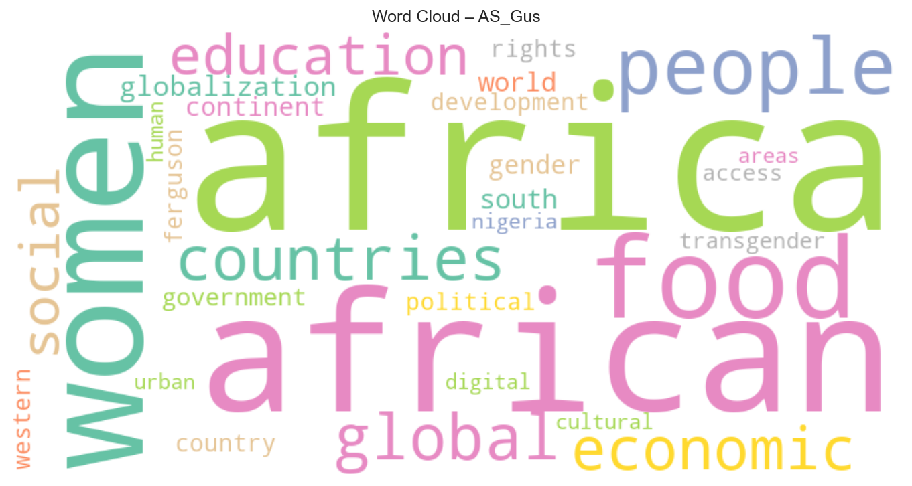
*africa e african dominano il centro della nuvola; women, food, economic, countries e education formano il secondo anello tematico, confermando il dualismo tra studi africani post-coloniali e questioni di genere e accesso.*

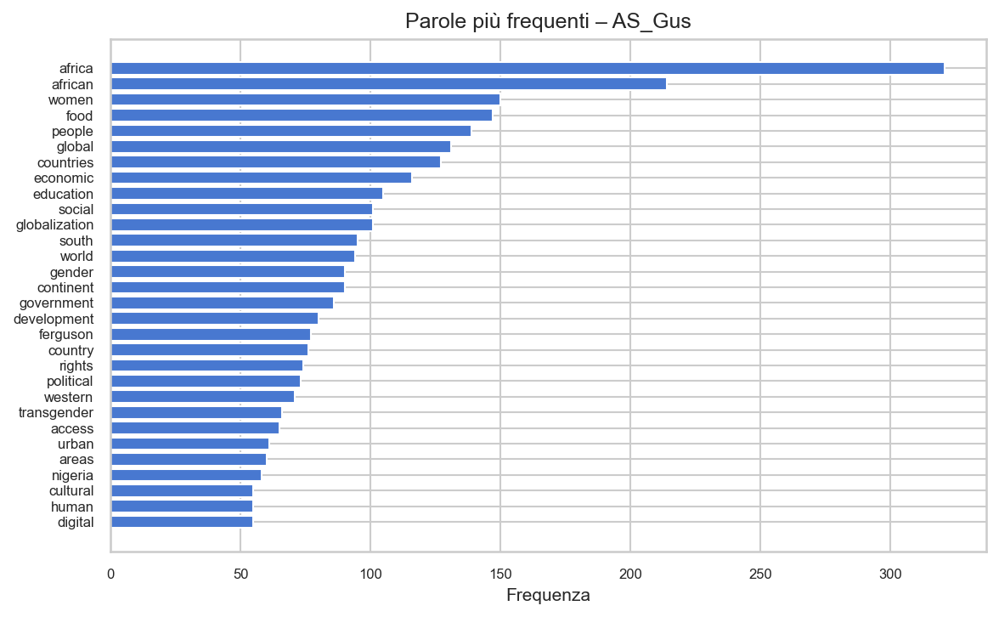
*africa (~320) guida la classifica con ampio margine, seguito da african (~215), women (~150) e food (~147). La distribuzione a coda lunga riflette la varietà tematica del corpus più grande in token della raccolta.*

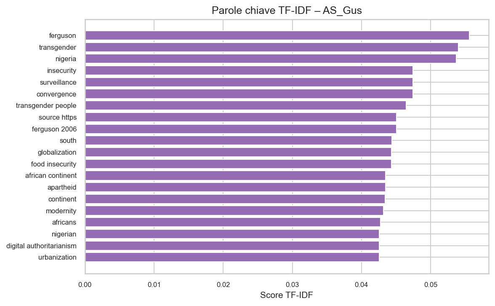
*Il TF-IDF isola i marcatori esclusivi di AS_Gus: ferguson, transgender, nigeria, food insecurity, surveillance, digital authoritarianism, apartheid, urbanization — termini che non compaiono in nessun'altra disciplina con pesi comparabili.*

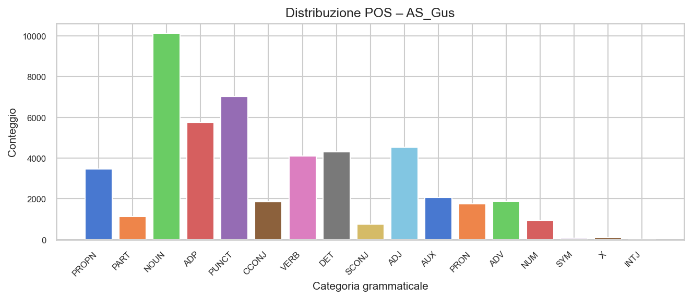
*NOUN (~10.000) è la categoria dominante; ADJ (~4.500) è il valore assoluto più alto del corpus, coerente con un registro descrittivo-qualificativo. ADP (~5.800) e PUNCT (~7.000) indicano struttura proposizionale articolata.*

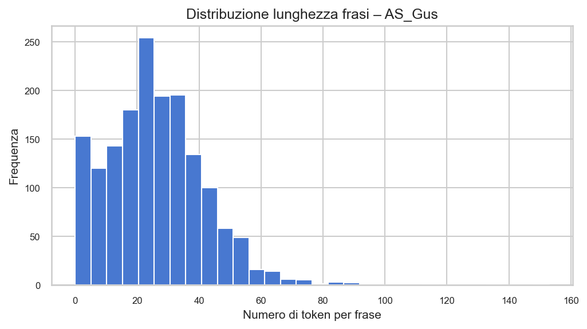
*Picco attorno a 20–25 token con coda che si estende fino a ~90. La distribuzione è più spostata a destra rispetto alla maggior parte delle discipline, confermando la tendenza a costrutti ampi (media 26 token).*

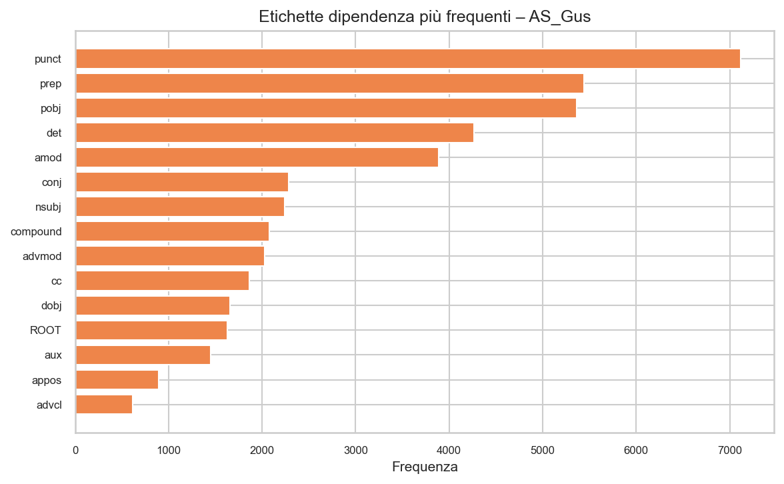
*punct, prep e pobj dominano, segnalando struttura preposizionale intensa. amod (~3.900) è elevato, coerente con la ricca modificazione aggettivale; appos (~900) indica uso frequente di appositivi, tipico del registro accademico descrittivo.*

---

## CILE_Pol

CILE_Pol è la disciplina di diritto societario e governance d'impresa. Le keyword TF-IDF — *shareholders*, *corporation*, *dominant position*, *external constituencies*, *legal personality*, *corporate law*, *merger*, *ownership* — delineano un lessico tecnico-giuridico preciso. Le frequenze confermano: *shareholders* (251), *company* (219), *market* (174), con bigrammi come *dominant position* (101) e *external constituencies* (76). Rispetto alla prima versione, scompare *unclear* dalla top 10 delle frequenze, segnale che il preprocessing ha gestito diversamente le risposte incomplete.

Morfologicamente, il TTR sale leggermente a 0.052 (da 0.048) su 1.516 lemmi unici. La percentuale di sostantivi è la più alta del corpus (NOUN 25.2%), con verbi al 10.0% — anch'essa in aumento rispetto alla prima versione. Le nominalizzazioni sono dense (1.369 totali, 5.29/100 token, il secondo valore più alto del corpus), con *business* (105), *corporation* (102), *minority* (79), e predominanza di *-tion* (619).

Sintatticamente, le frasi si allungano a 22.96 token/frase (+2.18 rispetto alla prima versione) con subordinazione 1.66 e profondità 7.13 — valori più alti di prima, che modificano parzialmente il profilo precedente di disciplina a sintassi contenuta. La coesione (294 marcatori, 24.69/100 frasi) ha *also* (108) e *because* (54) in testa; il diversità index è 0.068. Le formule accademiche sono 54 (2.11/1000 token), con *for example* (18) e *in order to* (13) dominanti.

Il topic dominante è T2 con copertura totale (35/35 documenti) — la distribuzione tematica più compatta dell'intero corpus. L'agency mostra soggetti concettuali al 56.0% e SrcAttr basso (2.4%). Il passivo è al 13.1%, con modali epistemici (386) e di permissione (342) alti in proporzione, coerenti con il discorso giuridico che qualifica condizioni di liceità.

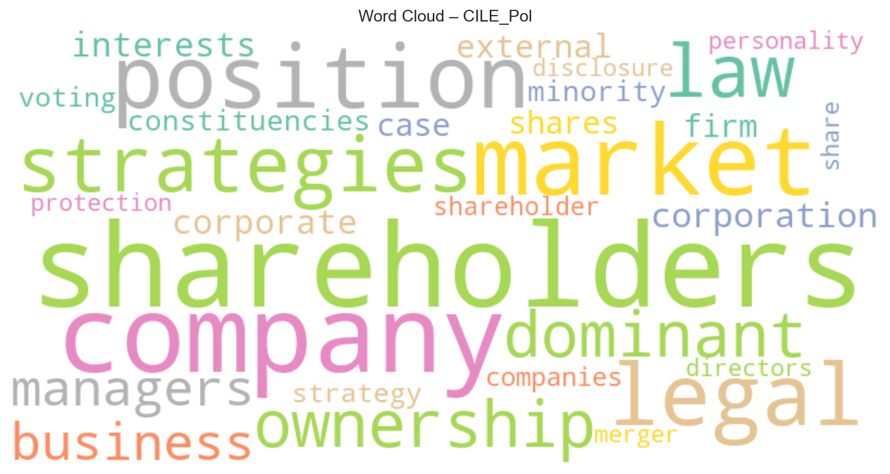
*shareholders domina visivamente; company, market, position, strategies, dominant, legal, ownership e corporation formano il nucleo del lessico societario. La densità del cloud riflette un vocabolario tecnico ripetuto e omogeneo.*

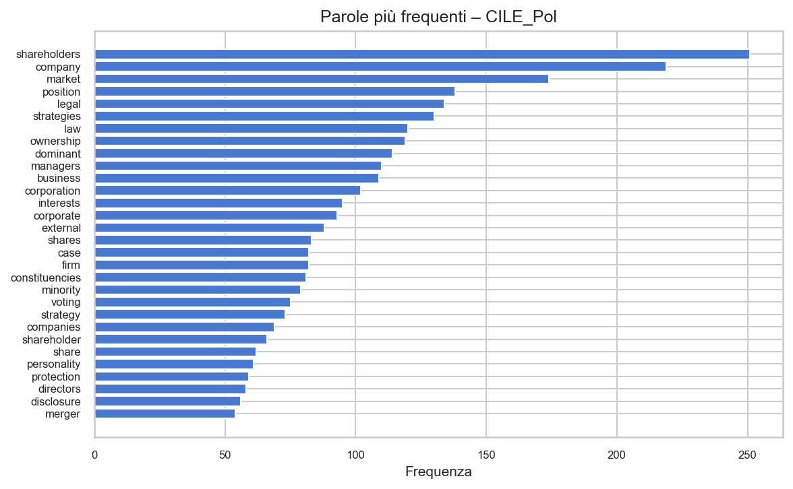
*shareholders (~200) e company (~175) guidano con largo distacco. La classifica è interamente occupata da termini giuridico-societari: market, managers, position, interests, directors, strategies, minority, shares.*

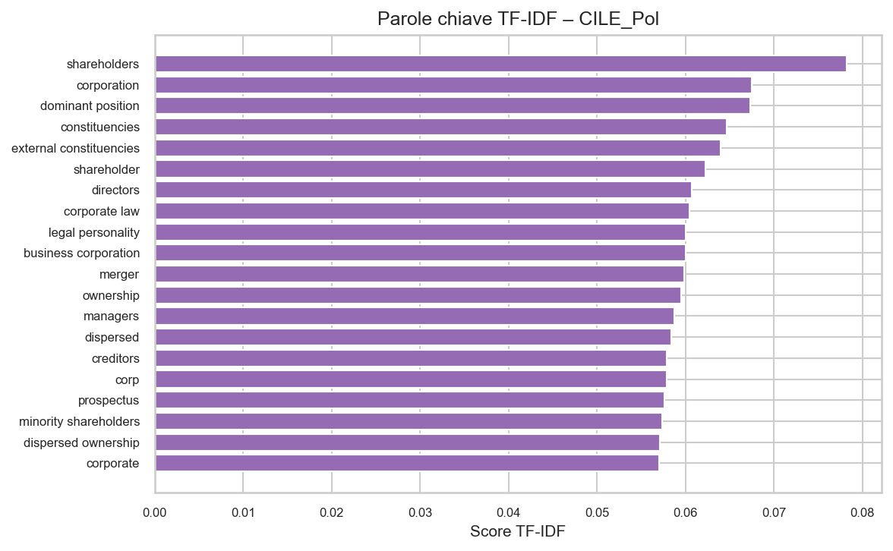
*Il TF-IDF conferma l'identità disciplinare: shareholders, corporation, dominant position, external constituencies, creditors, legal personality, business corporation, merger, dispersed ownership. Tutti i termini sono tecnici e giuridicamente precisi.*

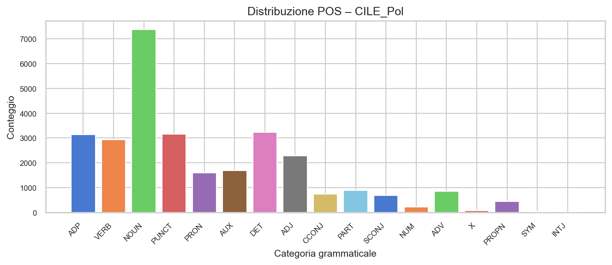
*NOUN (~7.300) domina con il valore proporzionalmente più alto del corpus (25.2%). DET (~3.200) e PUNCT (~3.150) seguono. La quasi assenza di PROPN riflette l'impersonalità del discorso giuridico societario.*

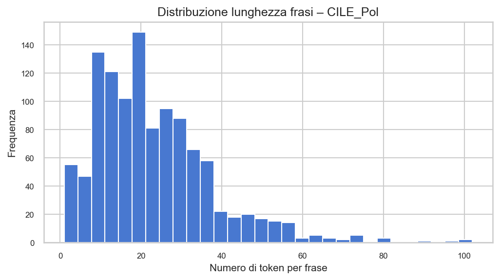
*Picco a 15–20 token ma con coda estesa fino a ~100 token. La distribuzione è più piatta di ELClass_Zot o ELSPS_Zot, segnalando la coesistenza di frasi brevi (definizioni) e frasi lunghe (disposizioni normative articolate).*

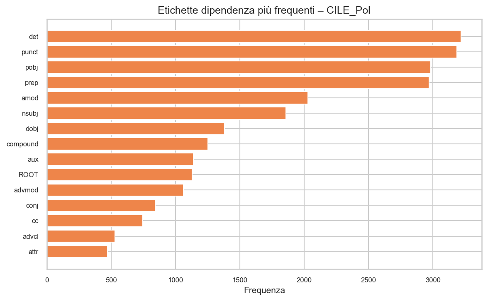
*det e punct in testa (~3.200 ciascuno), seguiti da pobj e prep — schema tipico di prosa nominale. nsubj (~1.860) e dobj (~1.360) confermano struttura predicativa presente ma secondaria rispetto alla modificazione nominale.*

---

## CLA_Pol

CLA_Pol è la disciplina di diritto dei mercati finanziari. Le keyword TF-IDF — *MiFID*, *MiFID II*, *financial instruments*, *derivative*, *algorithmic trading*, *natural gas*, *company alpha* — confermano il lessico specializzato già identificato. Le frequenze mostrano *price* (124), *financial* (117), *trading* (97), *instruments* (96), *alpha* (69). Rispetto alla prima versione, *unclear* scompare dalla top 10, lasciando spazio a *company* (55) come nuovo elemento di contenuto.

Morfologicamente, TTR a 0.074 su 1.015 lemmi unici. La percentuale di verbi è la più alta delle discipline giuridiche (VERB 10.9%), con sostantivi al 24.6%. Le nominalizzazioni sono 516 (4.21/100 token), con *investment* (63) e *instrument* (47) in testa. Il suffisso *-tion* domina (198), seguito da *-ment* (137).

Sintatticamente, le frasi crescono a 23.86 token/frase con subordinazione 1.79 e profondità 7.32 — valori più alti rispetto alla prima versione, che avvicinano CLA_Pol a CILE_Pol per complessità costruttiva. La coesione è moderata (127 marcatori, 24.47/100 frasi), con *also* (31) e *then* (28); il diversità index è 0.126. Le formule accademiche sono 44 (3.63/1000 token), con *in order to* (22) dominante.

Il topic dominante è T2 con copertura totale (19/19 documenti) — un'assegnazione diversa dalla prima versione, dove il topic dominante era T5. Questa variazione riflette probabilmente un ricalibramento del modello LDA piuttosto che un cambiamento reale del contenuto. L'agency mostra SrcAttr al 7.4%, il più alto tra le discipline giuridiche, coerente con la necessità di citare normative specifiche. Il passivo è al 12.6% e i modali di permissione (117) superano quelli di abilità (101) — inversione tipica del registro normativo.

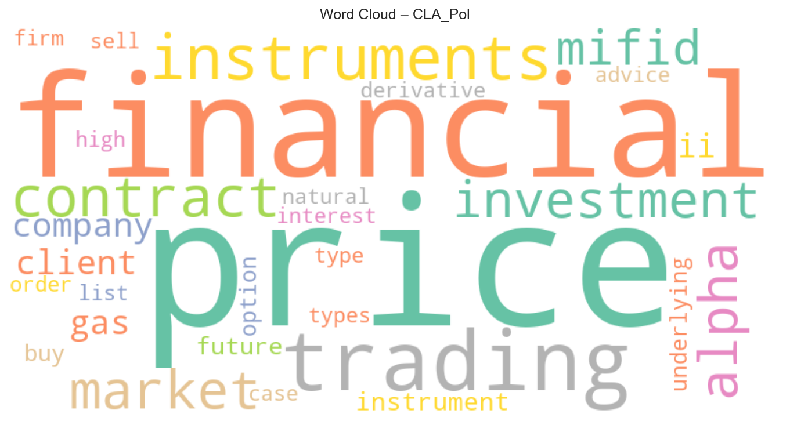
*financial e price dominano il centro, affiancati da instruments, trading, investment, mifid, contract, market e alpha. La nuvola è visivamente più compatta di CILE_Pol, con un polo tecnico-finanziario e un polo normativo (mifid, contract, client).*

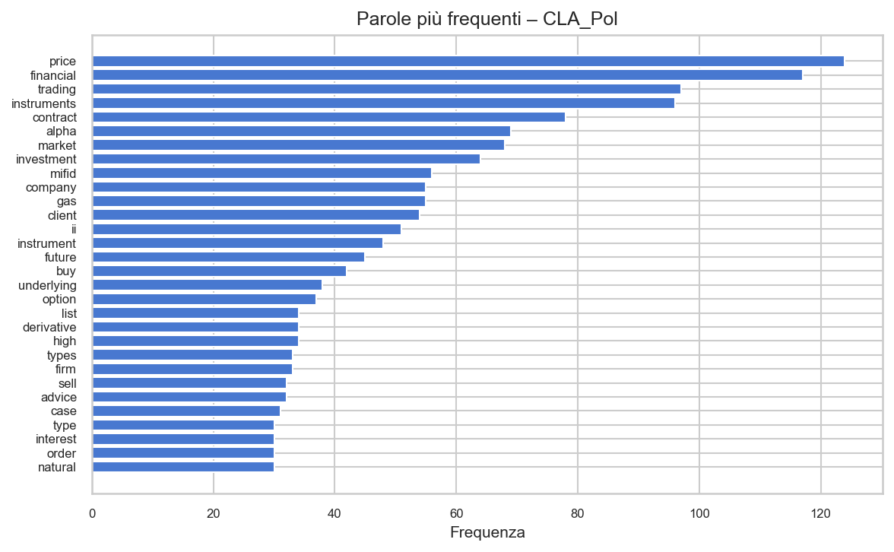
*price (~125) supera financial (~117); trading (~97) e instruments (~95) seguono. La presenza di alpha e mifid nella top 10 segnala la specificità dei case studies utilizzati nella disciplina.*

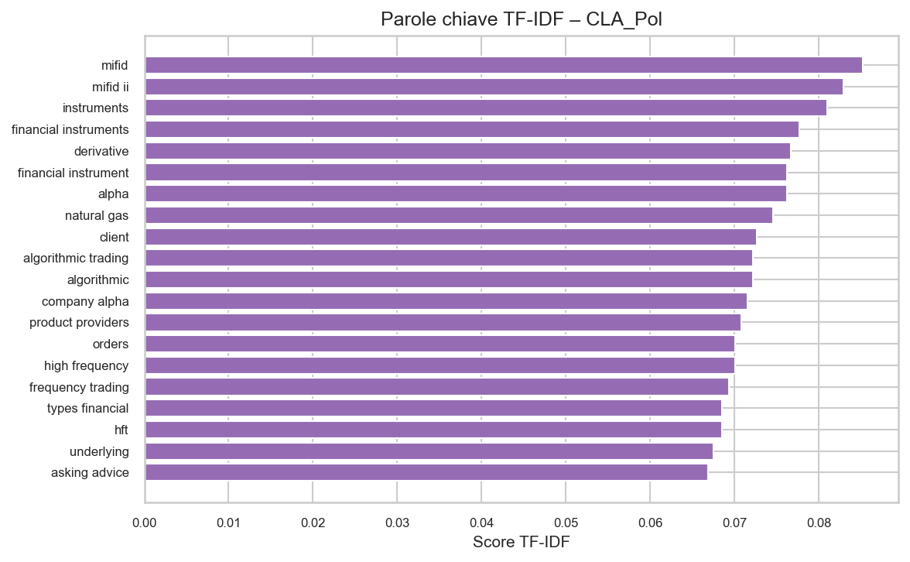
*mifid e mifid ii guidano con i punteggi più alti; seguono instruments, financial instruments, derivative, alpha, natural gas, algorithmic trading, hft, company alpha. Il profilo TF-IDF è il più discriminante in termini di punteggi assoluti tra le discipline giuridiche.*

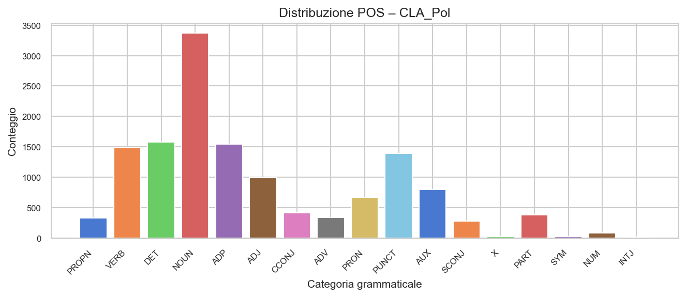
*NOUN (~3.400) domina; VERB (~1.500) e DET (~1.600) seguono. Rispetto a CILE_Pol, la proporzione di VERB è leggermente più alta, compatibile con un registro che descrive operazioni di mercato oltre che strutture normative.*

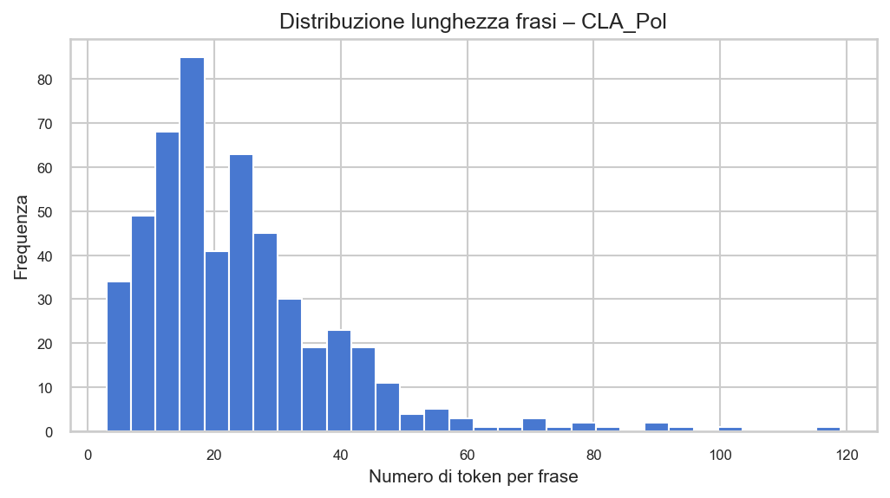
*Picco a 15 token con coda che si estende fino a ~120 token. La varianza è elevata: coesistono frasi definitorie brevi e costrutti normativi molto estesi, più di qualsiasi altra disciplina giuridica.*

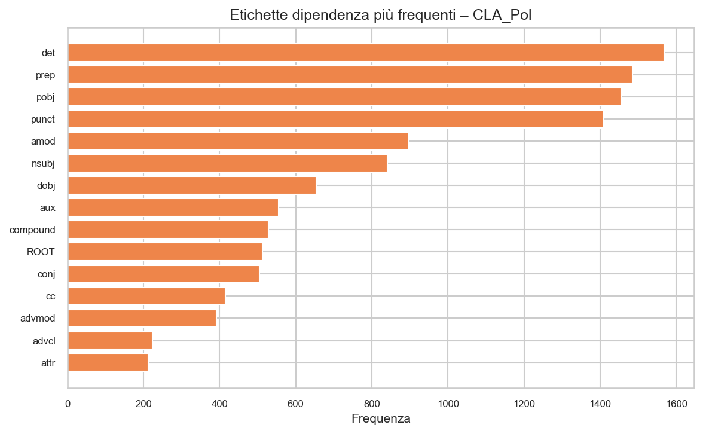
*det guida (~1.560), seguito da prep e pobj (~1.500/1.440). Il rapporto tra amod (~900) e nsubj (~840) indica modificazione nominale abbondante. compound e aux suggeriscono costruzioni nominali complesse tipiche del lessico finanziario.*

---

## CPH_Mor

CPH_Mor è la disciplina di storia economica e coloniale. Le keyword TF-IDF — *empires*, *merchants*, *merchant networks*, *spanish*, *native american*, *south asia*, *15th–16th century* — sono stabili rispetto alla prima versione. Le frequenze confermano *british* (117), *india* (117), *century* (114), *trade* (103), *decolonization* (88). Rispetto alla prima versione scompare *unclear* dalla top 10, sostituito da *europeans* (77).

Morfologicamente, TTR a 0.094 (+0.004) su 2.385 lemmi unici. La percentuale di aggettivi (ADJ 9.9%) è la più alta del corpus in questa versione, confermando il registro descrittivo e qualificativo della storia. Le nominalizzazioni sono 803 (3.52/100 token), con *decolonization* (88) e *independence* (34) in testa. La subordinazione sale a 1.34 e la profondità a 7.18, entrambi leggermente più alti della prima versione.

La coesione (275 marcatori, 27.12/100 frasi) vede *also* (79) e *because* (56) dominanti, con *first* (41) terzo. Il diversità index è 0.080. Le formule accademiche sono 59 (2.61/1000 token), con *for example* (23) e *in order to* (12) in testa. Il topic dominante in questa versione è T7 (14 documenti) con T1 (12) e T4 (5) — una distribuzione più articolata rispetto alla precedente centrata su T6. L'agency mostra una quota alta di "Other" (28.5%), riconducibile ai soggetti collettivi storici (popoli, Stati, compagnie).

Il passivo è al 12.9%, con modali epistemici bassi (106 su 3.532 verbi, 3.0%) — segnale di un discorso prevalentemente fattuale e narrativo con scarsa modulazione dell'incertezza. I modali di obbligo sono i più bassi in assoluto (12, 0.3%).

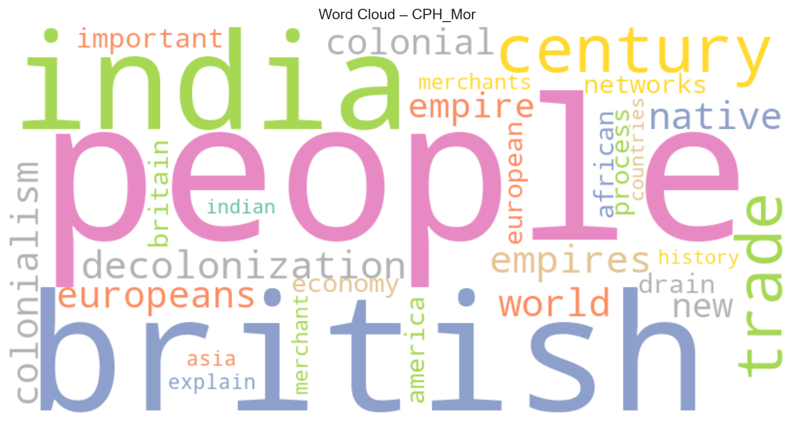
*british e india dominano; people, century, decolonization, europeans, trade, empires, colonial, merchants, asia e networks formano il campo semantico della storia imperiale. La nuvola è la più variegata geograficamente del corpus.*

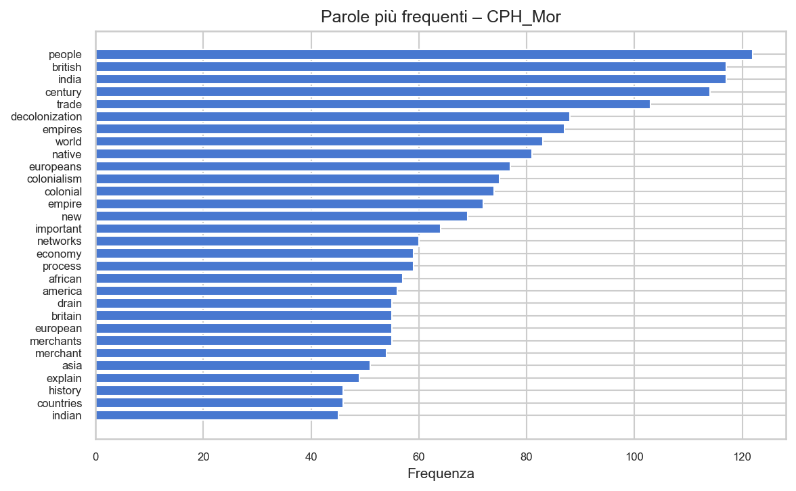
*people (~122), british (~118) e india (~115) guidano. La top 30 comprende century, trade, decolonization, empires, native, colonialism, colonial, empire, merchants, drain — un lessico storico narrativo coerente e privo di tecnicismi giuridici o scientifici.*

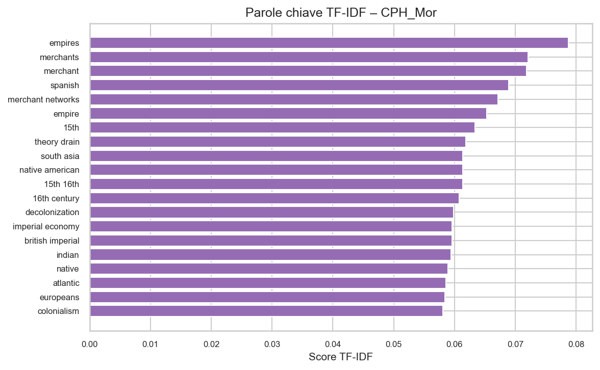
*empires, merchants, merchant networks, spanish, south asia, native american, 15th–16th century, theory drain, imperial economy, british imperial, atlantic, colonialism — termini storiografici con alta specificità di periodo e area geografica.*

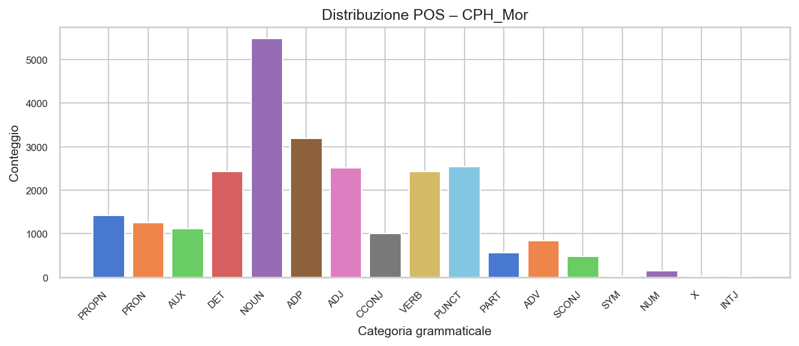
*NOUN (~5.450) domina con ADP (~3.200) e ADJ (~2.540) ai livelli più alti proporzionalmente del corpus. PRON (~1.250) è relativamente alto, riflettendo una narrazione che anima soggetti collettivi storici.*

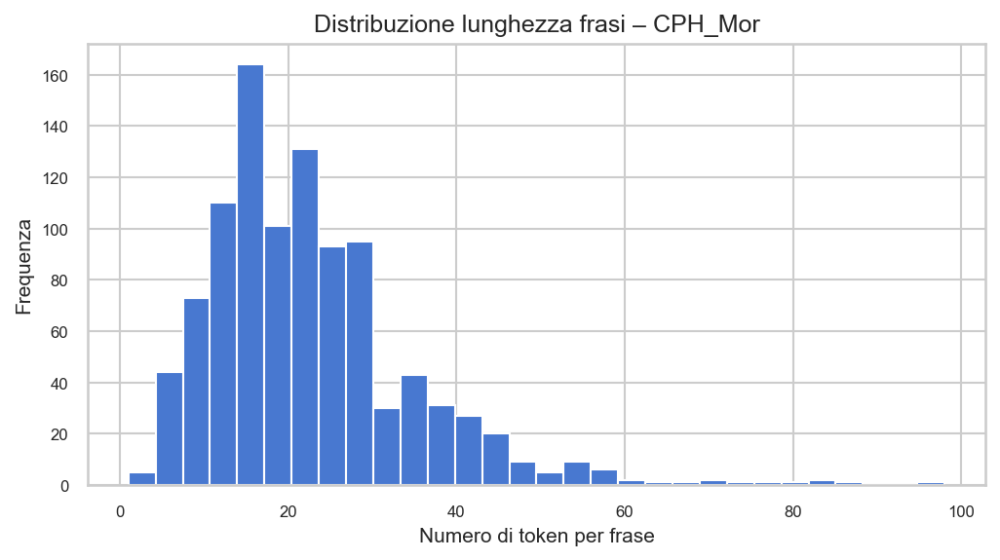
*Picco a 15–20 token con coda che si estende fino a ~100 token. La distribuzione è simile a CILE_Pol ma con una seconda concentrazione attorno a 35–40 token, segnalando la presenza di periodi narrativi più elaborati.*

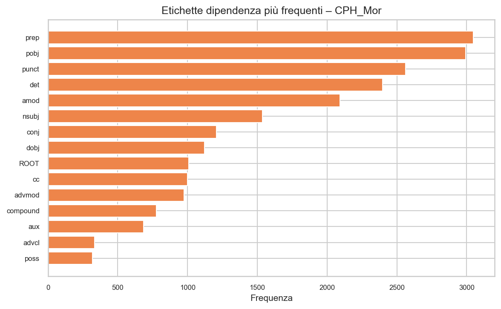
*prep (~3.060) supera pobj (~3.000) come etichetta più frequente — struttura preposizionale dominante. amod (~2.100) è elevato; poss (~350) compare tra le prime 15, inusuale rispetto alle altre discipline, riflettendo le costruzioni possessive del discorso storico (Britain's empire, India's economy).*

---

## DEIC_San

DEIC_San rimane un documento unico con il profilo già descritto. I dati della seconda versione sono quasi identici: TTR 0.188 su 593 lemmi unici (−3 rispetto a prima), nominalizzazioni 125 (4.88/100 token), frasi a 18.71 token/frase con subordinazione 0.93. Le keyword TF-IDF mostrano una novità: compaiono *shleifer 2014* e *shleifer* al posto di *graph* e *economic agents*, segnalando che il preprocessing ha ora catturato meglio i riferimenti bibliografici embedded nel testo.

Il topic assegnato è T3 (sviluppo, paesi, Africa) — diverso dal T5 della prima versione — ma con un solo documento la classificazione LDA ha valore puramente indicativo. Il passivo rimane al 15.4% e l'agency concettuale al 61.5%, valori stabili tra le due versioni.

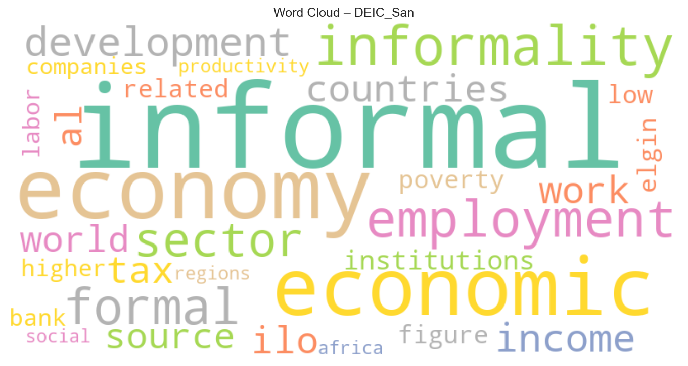
*informal è il termine più grande in assoluto; economy, economic, informality, employment, formal, sector, income, source, development formano il campo semantico dell'economia informale. La nuvola è quella con il vocabolario più denso e circoscritto del corpus, dato il volume ridotto del documento.*

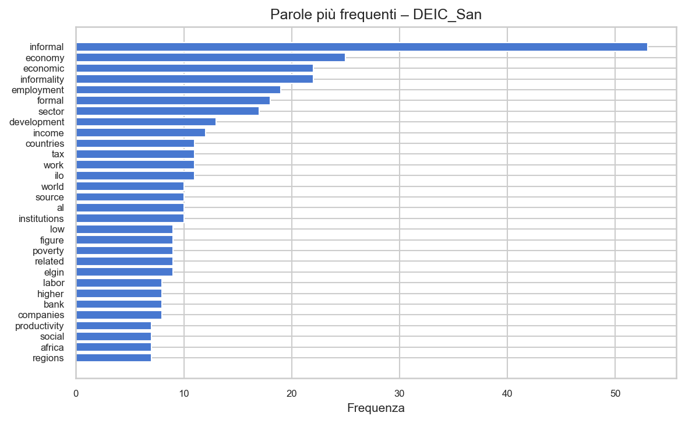
*informal (~52) domina con un vantaggio netto su economy (~26) e informality (~22). La classifica si abbassa rapidamente verso frequenze di 10–7, riflettendo l'esiguità del corpus (documento singolo).*

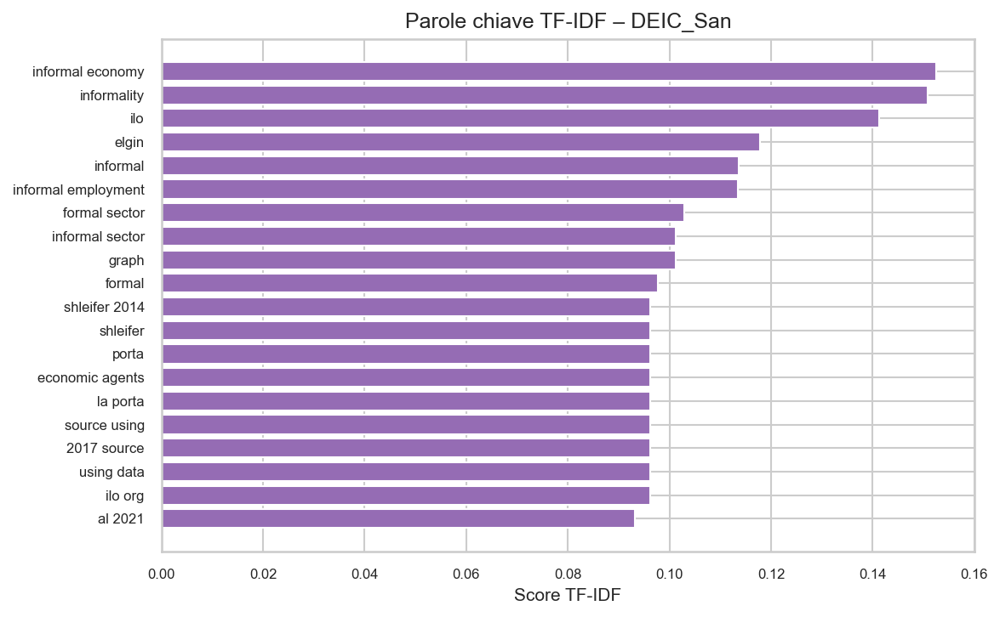
*informal economy e informality guidano con punteggi altissimi (>0.15). Compaiono ilo, elgin, informal employment, formal sector, shleifer, la porta, source using — termini bibliografici embedded nel testo, segnale di una risposta fortemente radicata nelle fonti.*

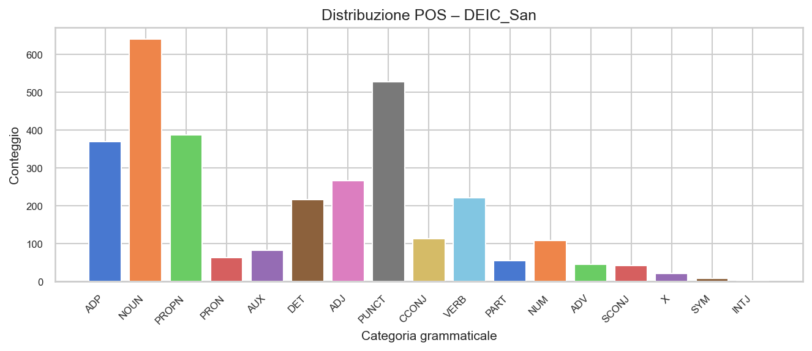
*NOUN (~640) domina nettamente; PROPN (~390) è proporzionalmente il più alto del corpus, confermando la presenza massiccia di nomi propri di autori e istituzioni (ILO, Elgin, Shleifer, La Porta). NUM (~105) è elevato, coerente con un testo a forte base empirica e statistica.*

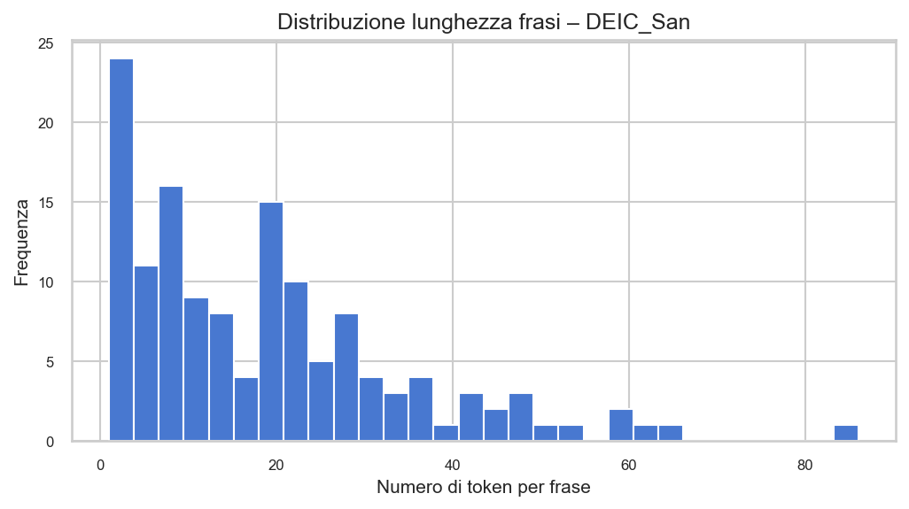
*La distribuzione è relativamente compatta (picco a 15–20 token) con coda moderata. Le frasi brevi sono più frequenti che in AS_Gus o GLD_Gog, compatibile con uno stile espositivo puntuale.*

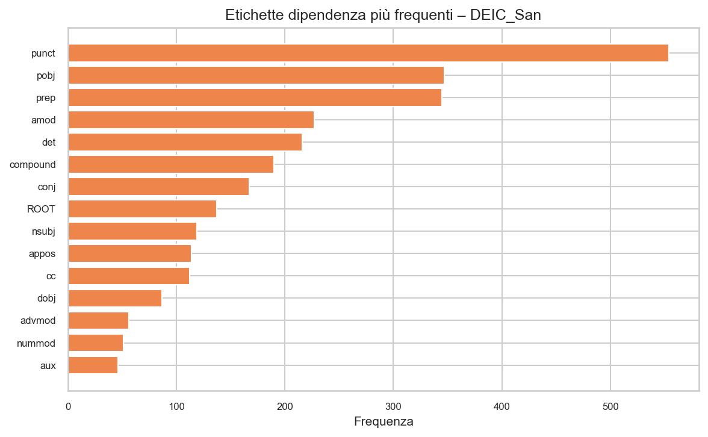
*Schema standard con punct, prep, pobj e det in testa. La presenza di NUM tra le prime etichette (tramite il tag num nella pipeline spaCy) riflette il gran numero di riferimenti quantitativi.*

---

## ELClass_Zot

ELClass_Zot è la disciplina di linguistica critica e analisi del discorso. Le keyword TF-IDF — *ethnolect*, *disability*, *racist discourse*, *medical model*, *van Dijk*, *sexism*, *linguistic strategies*, *direct sexism* — sono stabili, con l'aggiunta di *direct sexism* rispetto alla prima versione. Le frequenze mostrano *language* (54), *person* (44), *people* (39), *disability* (38). Rispetto alla prima versione scompaiono *question* e *response* dalla top 10 (erano presenti con 28 occorrenze ciascuno), il che indica che il preprocessing ha ora escluso o ridotto il metaregistro valutativo.

Morfologicamente, TTR sale a 0.128 (da 0.116) su 395 lemmi unici. La percentuale di verbi sale a 10.6% e di aggettivi a 9.6% — quest'ultima la più alta del corpus in questa versione — compatibile con un discorso analitico e descrittivo. Le nominalizzazioni sono 104 (3.82/100 token), con predominanza di *-ity* (71 occorrenze), guidata da *disability* (38).

Sintatticamente, le frasi si accorciano ulteriormente a 16.51 token/frase (da 14.81 della prima versione, ma con un token count totale diverso), con subordinazione 1.26 e profondità 6.13. La coesione è 34 marcatori (20.48/100 frasi), con *first* (13) dominante — strutturazione per punti. Il topic dominante è T0 con copertura totale (7/7 documenti) — cambiamento rispetto al T4 della prima versione, che potrebbe riflettere una diversa parametrizzazione del modello. L'agency mostra AuthorID al 10.3%, coerente con la citazione sistematica di van Dijk e altri autori della CDA.

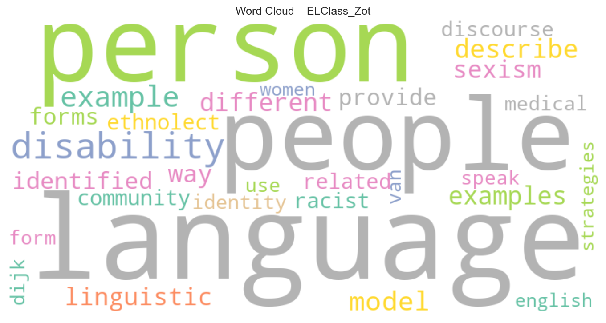
*person è il termine più grande, seguito da people e language. disability, sexism, discourse, model, ethno, describe, linguistic, community formano il campo semantico della linguistica critica e dell'analisi del discorso — un cloud molto diverso da tutte le altre discipline.*

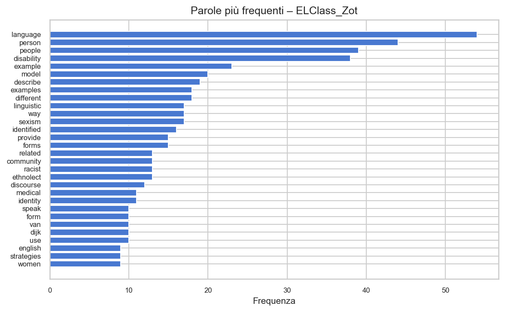
*language (~52) guida, seguito da person (~44) e people (~40). disability (~38) è quarto — inusuale in un corpus accademico, segno della specificità del syllabus. Frequenze basse in assoluto per il volume ridotto del corpus.*

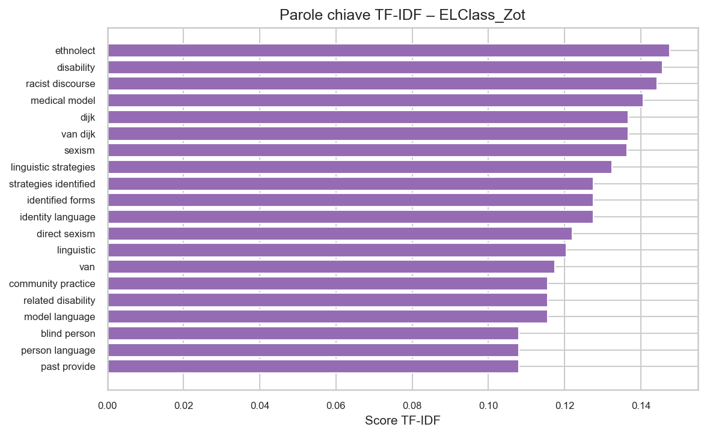
*ethnolect, disability, racist discourse, medical model, van dijk, sexism, linguistic strategies, strategies identified, identity language, community practice, modal language — termini della CDA (Critical Discourse Analysis) con alta distintività rispetto al corpus.*

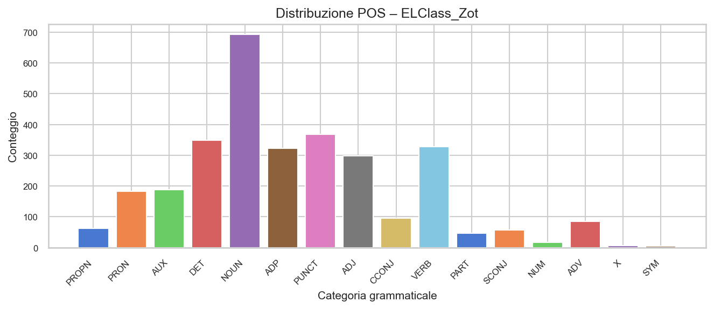
*NOUN (~700) domina ma con un divario minore rispetto alle discipline scientifiche; VERB (~330) e ADJ (~300) sono proporzionalmente tra i più alti del corpus. PRON (~190) è significativo, segnalando un discorso che include parlanti e soggetti esperienziali.*

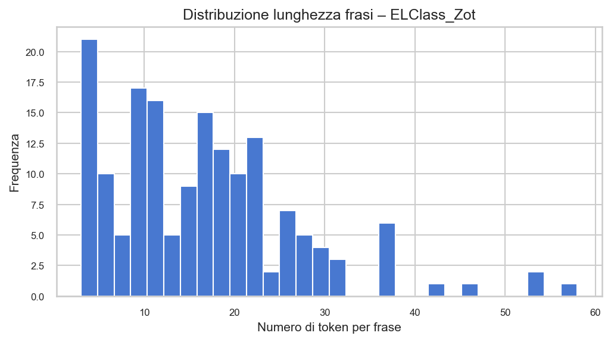
*Picco a 5–7 token con distribuzione bimodale: molte frasi brevi (risposte puntali) e una seconda concentrazione attorno a 15–25 token. Il range si estende fino a ~60. È il profilo più irregolare del corpus.*

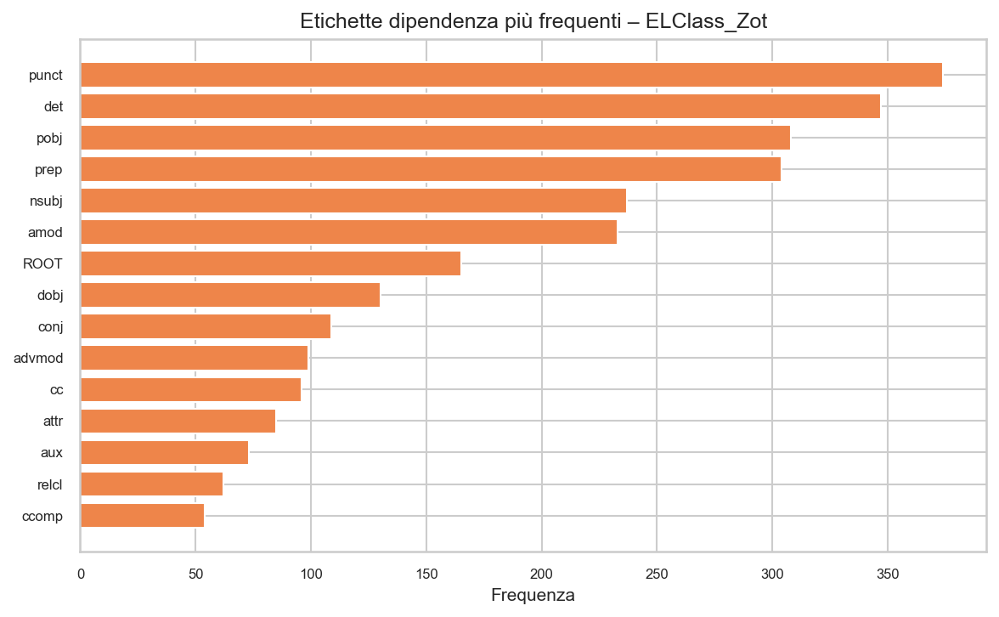
*punct e det in testa (~370/345); pobj e prep seguono (~305/303). attr (~85) e relcl (~62) sono relativamente presenti, segnalando costrutti relativi e attributivi frequenti. ccomp (~50) indica subordinate completive, compatibili con il discorso analitico.*

---

## ELSPS_Zot

ELSPS_Zot è la disciplina di pragmatica e argomentazione. Le keyword TF-IDF — *persuasion*, *model argumentation*, *model persuasion*, *sarcasm*, *interviewer*, *interviewee*, *argumentation defined* — sono stabili, con l'aggiunta di *argumentation defined*. Rispetto alla prima versione, scompaiono dalla top 10 delle frequenze *question* (69) e *response* (50) — i termini più marcatamente metaregistrativi — confermando un preprocessing più pulito in questa versione.

Morfologicamente, TTR a 0.117 su 821 lemmi unici. La percentuale di verbi (VERB 10.9%) è la più alta del corpus in questa versione, a pari merito con ELClass_Zot, compatibile con un discorso procedurale che descrive azioni argomentative. Le nominalizzazioni sono 315 (5.22/100 token), con *persuasion* (51) dominante e distribuzione equilibrata tra *-tion* (151) e *-sion* (57).

Sintatticamente, le frasi si accorciano a 18.28 token/frase (da 16.86 della prima versione), con subordinazione 1.51 e profondità 6.54. La coesione (52 marcatori, 15.85/100 frasi) mantiene *because* (21) come marcatore dominante, confermando la forte componente causale-esplicativa. Le formule accademiche hanno la seconda densità più alta del corpus (4.71/1000 token). Il topic dominante è T0 con copertura totale (10/10 documenti), a pari con ELClass_Zot — il che suggerisce che il modello LDA raggruppa le due discipline Zot in un unico cluster linguistico.

L'agency mostra soggetti concettuali al 45.0% (tra i più bassi del corpus) e "Other" al 29.9%, riflettendo la natura del discorso pragmatico dove i soggetti sono spesso parlanti, interlocutori e atti linguistici. Il passivo è al 13.5%, nella norma.

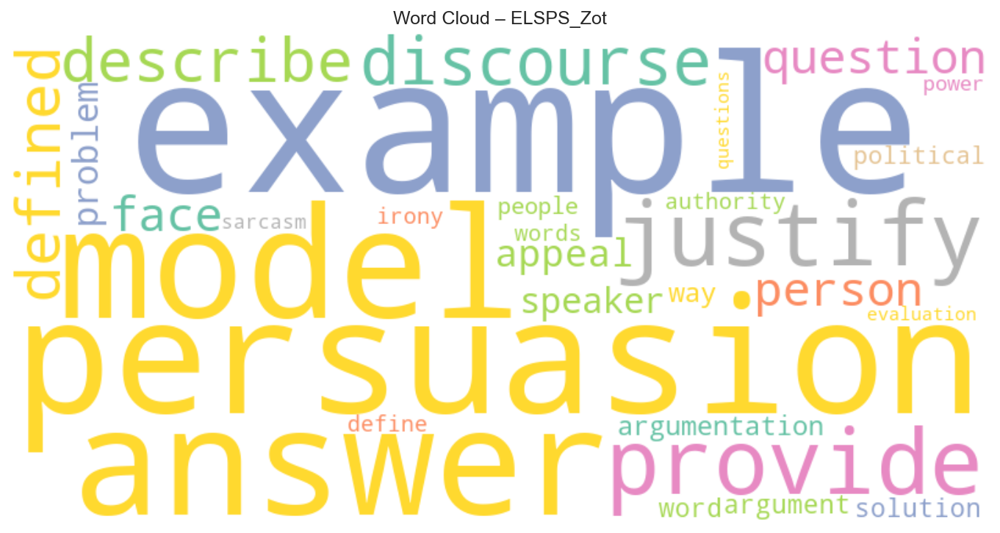
*example e persuasion dominano il centro; model, answer, discourse, justify, define, describe, argumentation, person, provide formano il nucleo del discorso pragmatico. Il cloud riflette un meta-linguaggio procedurale — si descrivono atti argomentativi più che contenuti.*

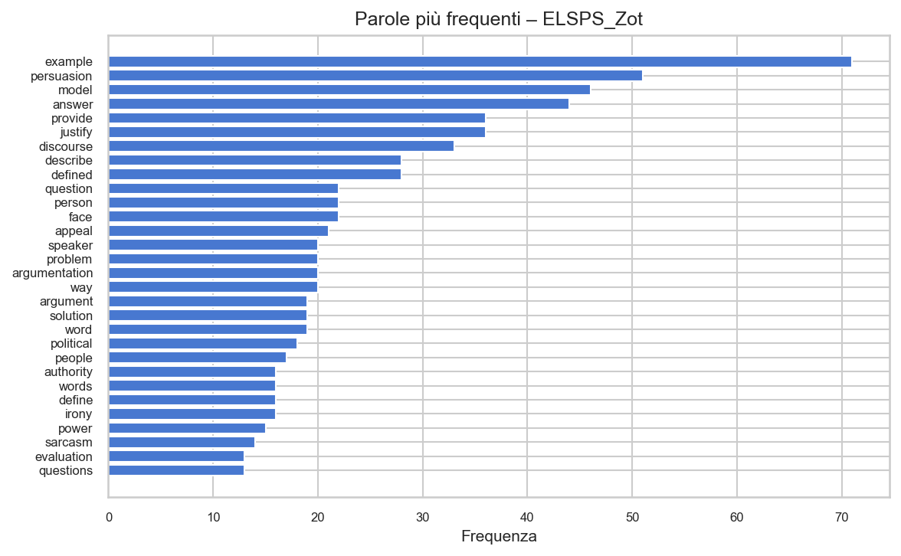
*example (~70) è il termine più frequente, seguito da persuasion (~60), answer, provide, discourse, model. La predominanza di example è inusuale e riflette la struttura didattica delle risposte (giustificazione con esempi).*

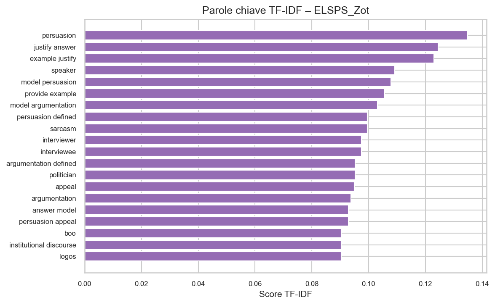
*persuasion, justify answer, model persuasion, sarcasm, interviewer, interviewee, argumentation defined, petitioner, institutional discourse — termini della pragmatica e teoria dell'argomentazione con alta specificità. I bigrammi dominano, segnalando collocazioni fisse nel metalinguaggio disciplinare.*

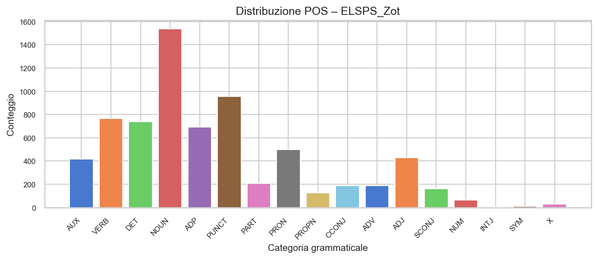
*NOUN (~1.540) e PUNCT (~960) dominano; VERB (~770) è proporzionalmente il più alto del corpus (con ELClass_Zot), compatibile con un discorso che descrive azioni argomentative. AUX (~420) è elevato, riflettendo l'uso di costruzioni modali e passive.*

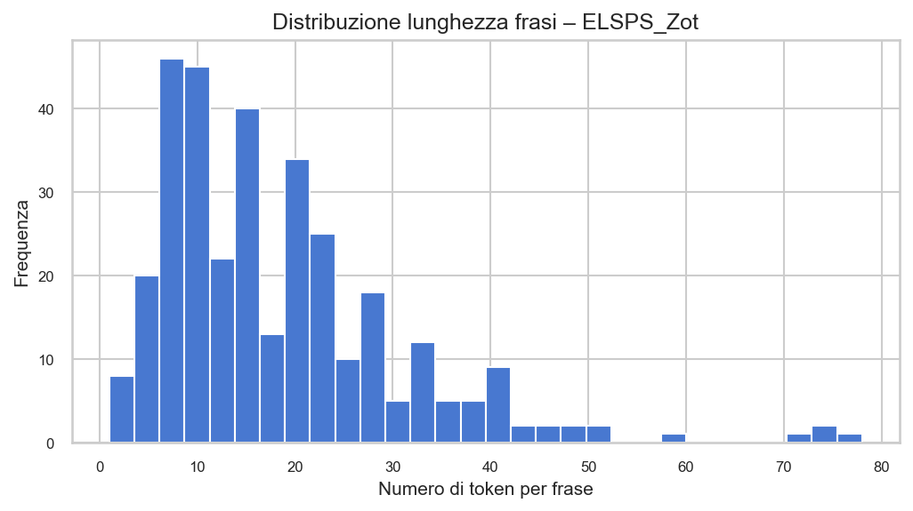
*Picco a 7–9 token con distribuzione spostata verso frasi brevi. La coda si estende fino a ~80 token con una seconda concentrazione attorno a 18–22 token. Il profilo è bimodale: risposte brevi e esposizioni argomentative più estese.*

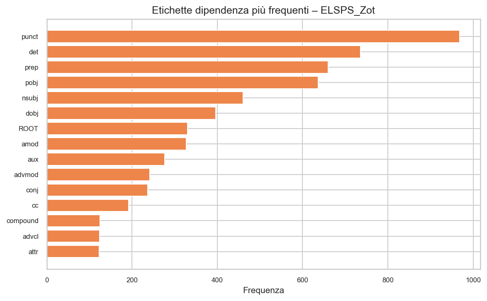
*punct (~970) domina nettamente; det (~735), prep (~660) e pobj (~640) seguono. Il rapporto nsubj/dobj (~470/395) indica predicazione transitivia abbondante. advmod e advcl sono relativamente frequenti, compatibili con un discorso che modifica e subordina azioni.*

---

## EOK_Geu

EOK_Geu è la disciplina di economia dell'innovazione e della conoscenza. Le keyword TF-IDF — *sci hub*, *shadow libraries*, *brain drain*, *skilled migration*, *university industry*, *publishers* — sono stabili. Le frequenze confermano *hub* (111), *sci* (110), *countries* (108), *innovation* (101).

Morfologicamente, TTR a 0.099 su 1.956 lemmi unici. Le nominalizzazioni sono 747 (4.50/100 token), con *innovation* (97), *migration* (59), *university* (51) in testa. Sintatticamente, le frasi sono a 18.63 token/frase con subordinazione 0.97 — tra le più basse del corpus, compatibile con un registro espositivo diretto. La coesione (193 marcatori, 18.61/100 frasi) è dominata da *also* (67), con *however* (14), *moreover* (13) e *because* (13) a seguire.

Il topic dominante è T3 in questa versione (8 documenti), con T1 (1), T4 (1) e T5 (3) — una distribuzione più articolata rispetto alla prima versione (dove T6 dominava). La variazione è significativa e suggerisce che il modello LDA ha riassegnato i documenti sull'innovazione dal cluster "storia economica/commercio" (T6) al cluster "sviluppo/globalizzazione" (T3), probabilmente per effetto di un lessico condiviso con AS_Gus e GLD_Gog. L'agency mostra SrcAttr al 9.6%, il più alto del corpus dopo NAL_Car e GLD_Gog, confermando una disciplina empiricamente orientata. Il passivo è il più basso del corpus (8.4%).

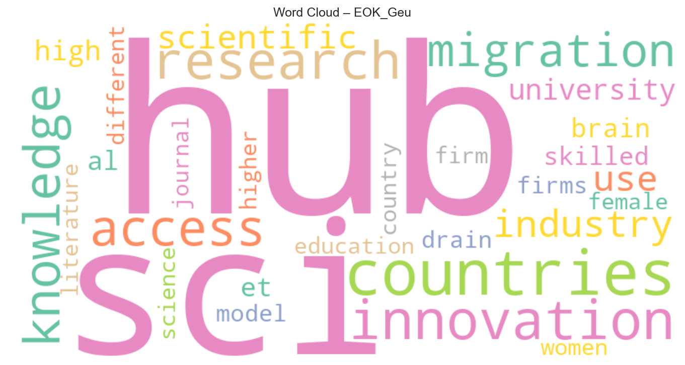
*hub e sci dominano il centro con grande prominenza (formano il bigramma sci hub); countries, innovation, research, knowledge, access, migration, industry, brain, skilled, drain formano i due poli tematici della disciplina: accesso alle pubblicazioni e migrazione qualificata.*

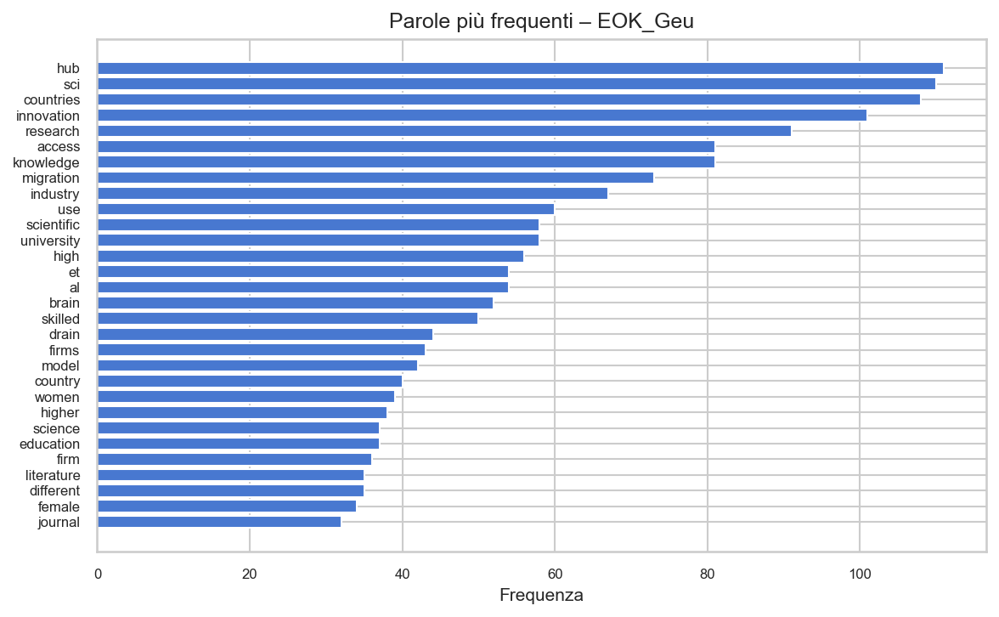
*hub (~112) e sci (~110) guidano a parità; countries (~108) e innovation (~101) seguono. research (~91), access (~81), knowledge (~80) e migration (~73) completano la top 10 — profilo lessicale che unisce economia della conoscenza e politiche di accesso aperto.*

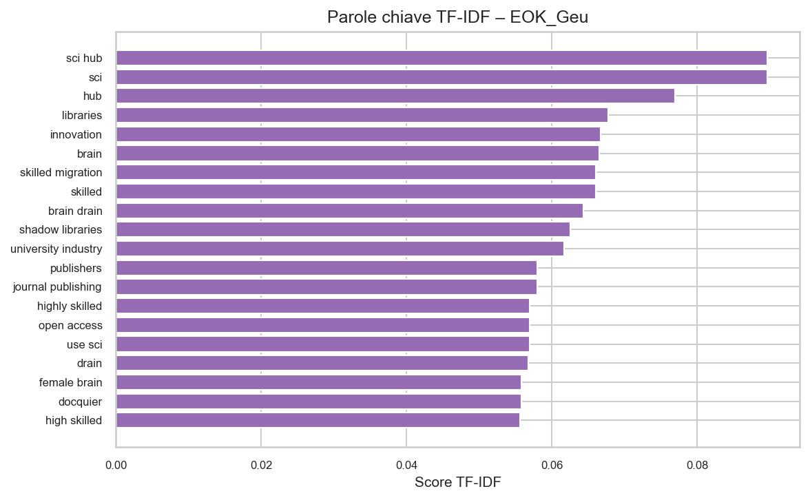
*sci hub e sci guidano con punteggi eccezionalmente alti (>0.09); seguono hub, libraries, innovation, brain, skilled migration, brain drain, shadow libraries, university industry, publishers, open access, female brain, docquier. Il profilo TF-IDF è il più bipartito del corpus, con un cluster sulla condivisione della conoscenza e uno sulla mobilità dei talenti.*

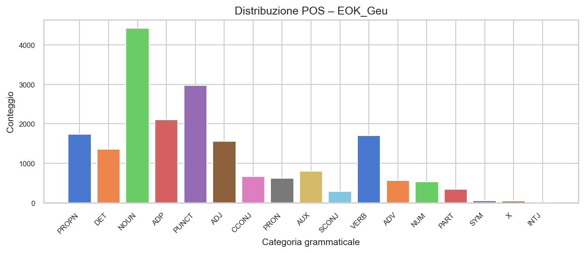
*NOUN (~4.400) domina; PROPN (~1.730) è elevato per via dei nomi propri di autori e piattaforme (Sci-Hub, Docquier). VERB (~1.720) è ben rappresentato. ADJ (~650) è relativamente basso, coerente con un registro espositivo più che valutativo.*

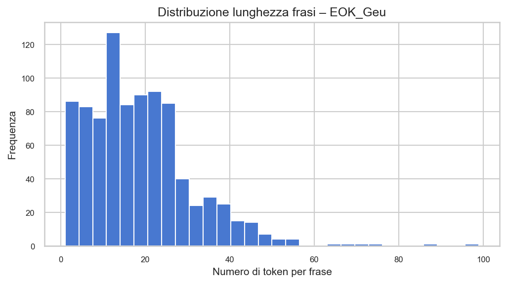
*Picco a 12–13 token — tra i più bassi del corpus — con distribuzione che declina rapidamente dopo i 25 token. La coda si estende fino a ~100 token ma con frequenze molto basse. Conferma il registro espositivo diretto (subordinazione 0.97).*

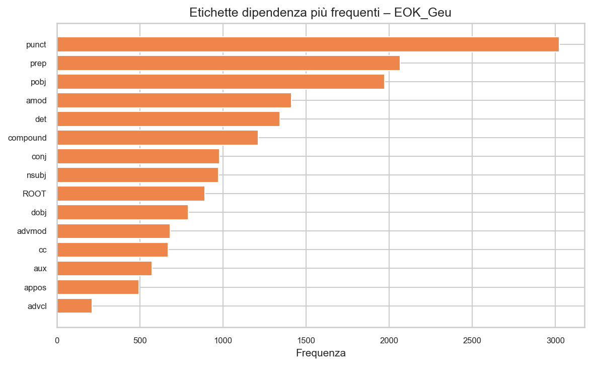
*punct (~3.050) e prep/pobj (~2.070/1.970) dominano. compound (~1.170) è tra i valori più alti del corpus, riflettendo i numerosi nomi composti del lessico tecnico (brain drain, shadow libraries, journal publishing). appos (~470) indica uso di appositivi per citare fonti.*

---

## GLD_Gog

GLD_Gog è la disciplina degli studi sullo sviluppo sostenibile e la governance globale. Le keyword TF-IDF — *SDGs*, *interdisciplinarity*, *NGOs*, *anthropocene*, *development studies*, *foreign agents*, *Norwegian* — sono stabili. Le frequenze confermano *development* (110), *NGOs* (65), *SDGs* (40), *interdisciplinarity* (33).

Morfologicamente, TTR a 0.132 su 1.682 lemmi unici. La percentuale di aggettivi è 9.1%, tra le più alte del corpus. Le nominalizzazioni sono 530 (4.76/100 token), con *development* (89) e *interdisciplinarity* (22) in testa. GLD_Gog mantiene i valori sintattici più estremi: frasi a 29.82 token/frase, subordinazione 1.92 e profondità 8.22 — la disciplina strutturalmente più complessa del corpus in tutte e tre le dimensioni sintattiche.

La coesione è la più densa del corpus (130 marcatori, 33.94/100 frasi), con *also* (37) e *first* (17) in testa. Il diversità index (0.192) è tra i più alti. Le formule accademiche (30 totali, 2.73/1000 token) mostrano una varietà media (uniq ratio 0.450). Il topic dominante è T3 (2 documenti) con T5 (1) e T7 (1) — distribuzione stabile rispetto alla prima versione. L'agency mostra SrcAttr al 13.5% e AuthorID al 8.0%, i profili più alti del corpus per attribuzione a fonti, compatibili con una disciplina fortemente orientata alla letteratura secondaria. Il passivo è al 11.7%.

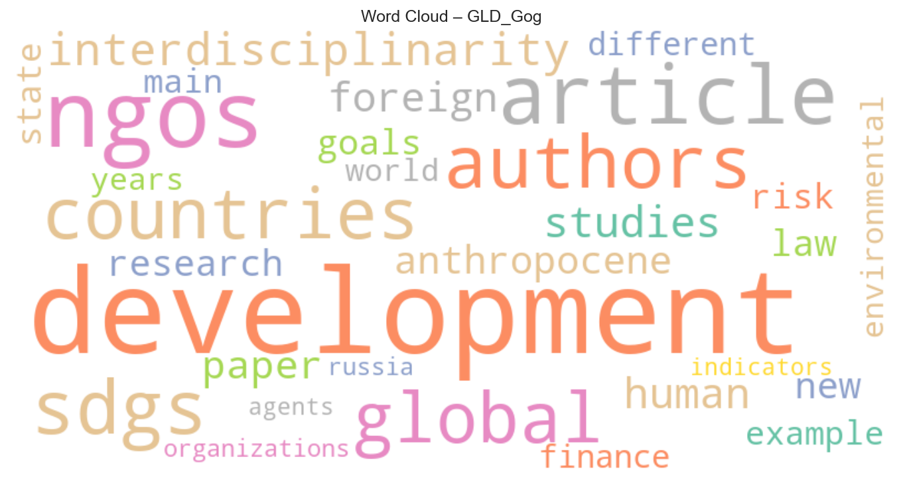
*development è il termine visivamente più grande; ngos, article, authors, sdgs, countries, global, interdisciplinarity, anthropocene, foreign, risk, law, environmental formano il campo semantico della governance globale e degli studi sullo sviluppo sostenibile.*

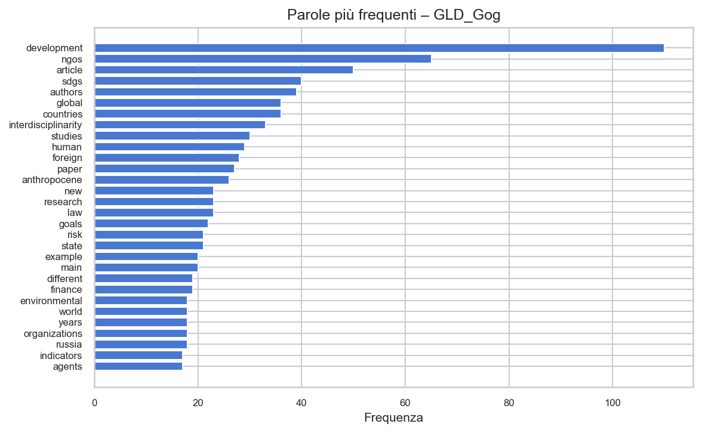
*development (~110) guida con ampio margine; ngos (~65) e article (~50) seguono. sdgs (~46) e authors (~43) sono inusuali in una top 10 — la prima indica l'agenda di sviluppo ONU, la seconda segnala una scrittura meta-accademica che discute la letteratura.*

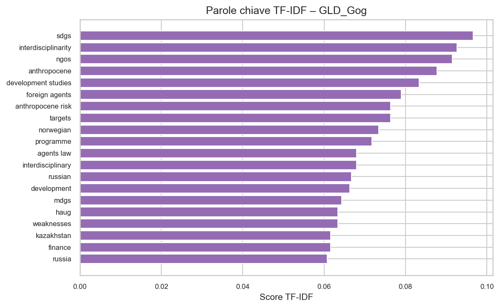
*sdgs, interdisciplinarity, ngos, anthropocene, development studies, foreign agents, anthropocene risk, norwegian, programme, agents law, russian, mdgs, haug, kazakhstan — termini estremamente specifici che localizzano la disciplina nel dibattito sulla governance globale e sui casi studio geopolitici (Russia, Kazakistan, Norvegia).*

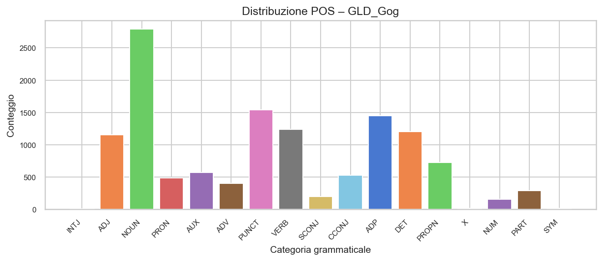
*NOUN (~2.750) domina; ADJ (~1.160) è proporzionalmente tra i più alti del corpus. VERB (~1.240) e PUNCT (~1.540) seguono. La distribuzione POS è la più equilibrata del corpus, compatibile con un registro accademico denso e argomentato.*

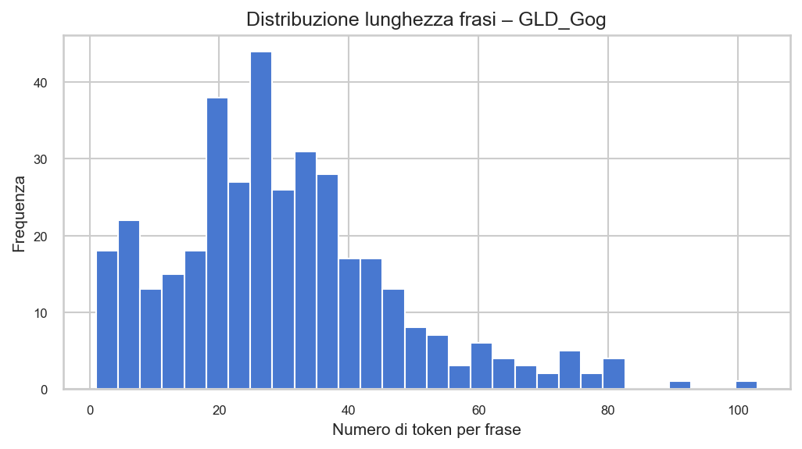
*Il picco è a 25–27 token — il più spostato a destra del corpus — con distribuzione larga e coda che raggiunge 100 token. Questa è la visualizzazione più eloquente della complessità sintattica di GLD_Gog (media 29.82 token, subordinazione 1.92).*

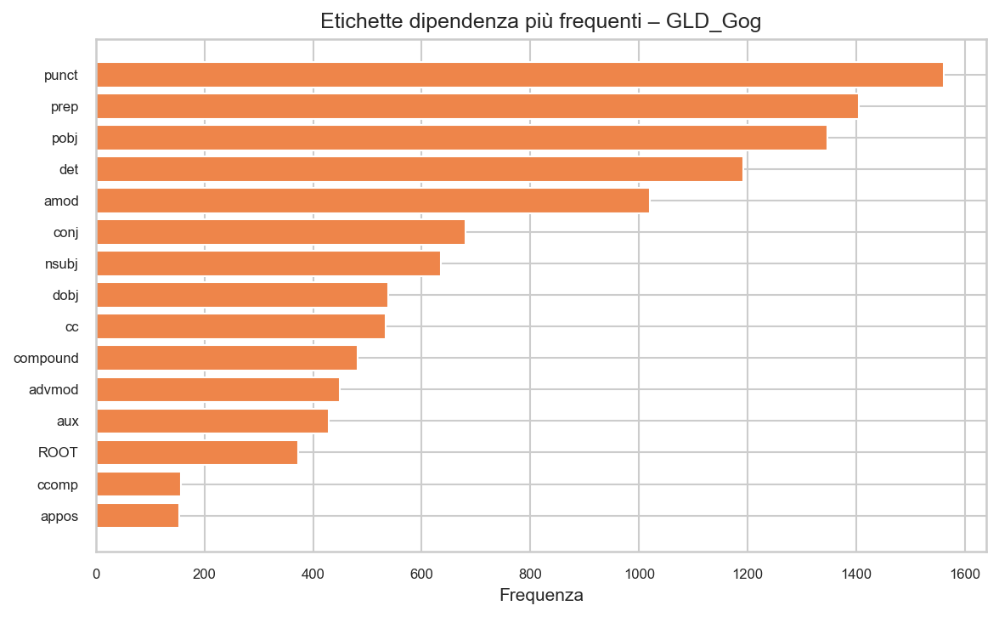
*punct (~1.550) in testa, seguito da prep e pobj (~1.400/1.340). conj (~680) è tra i valori più alti in proporzione, indicando coordinazione frequente tra sintagmi. ccomp (~160) e appos (~145) segnalano costrutti sintatticamente complessi.*

---

## NAL_Car

NAL_Car è la disciplina di cultura nordamericana focalizzata sull'individualismo. Le keyword TF-IDF — *individualism*, *murray*, *self reliance*, *melting pot*, *thoreau*, *bellah*, *hoover*, *emerson*, *diaz* — sono stabili, con l'aggiunta di *diaz* rispetto alla prima versione, segnale che il testo su Junot Díaz è ora più chiaramente identificato. Le frequenze confermano *american* (78), *individualism* (55), *murray* (36), *self* (36).

Morfologicamente, TTR a 0.156 su 1.016 lemmi unici. La densità di formule accademiche è la più alta del corpus (5.63/1000 token), con *in order to* (19) dominante. Sintatticamente, le frasi sono a 25.60 token/frase con subordinazione 1.73 e profondità 7.82 — il secondo profilo sintattico più complesso del corpus dopo GLD_Gog. Le nominalizzazioni sono 241 (4.17/100 token), con *government* (28) e *reliance* (22) in testa.

La coesione (55 marcatori, 22.45/100 frasi) mostra un diversità index di 0.291 — tra i più alti — indicando una gamma retorica più variata rispetto alle discipline scientifiche. Il topic dominante è T3 (4 documenti) a pari con T7 (4 documenti), distribuzione diversa dalla prima versione (che aveva T3 per tutti gli 8 documenti), indicando che alcuni testi sull'individualismo vengono ora assegnati al topic con *food*, *woman*, *hub*, *africa*, probabilmente per la presenza di temi di diversità e identità. L'agency mostra l'anomalia già nota: SrcAttr al 20.4% (più alto del corpus) con AuthorID al 1.0% (più basso del corpus). Il passivo è al 10.8%.

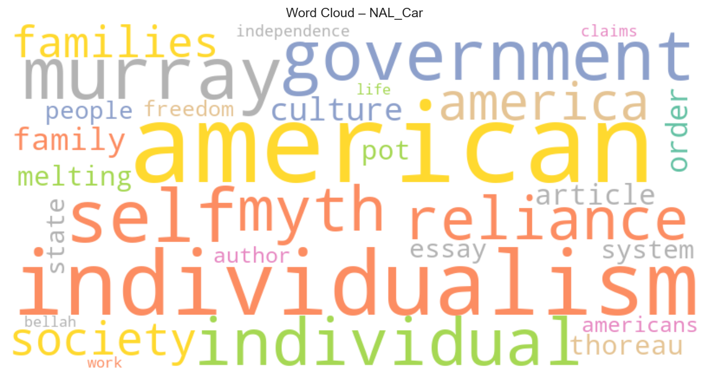
*individualism è il termine dominante; american, self, myth, reliance, society, murray, government, culture, families, individual, melting (pot) formano il campo semantico del dibattito sull'identità americana. Il cloud è unico nel corpus per la sua centralità valoriale.*

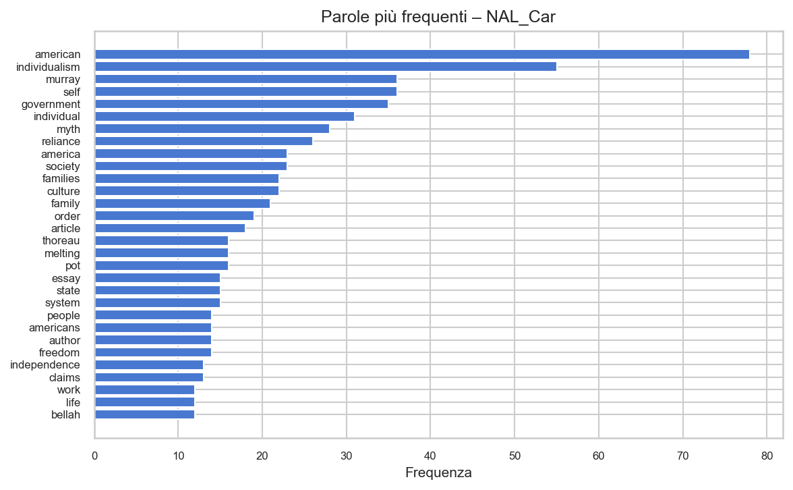
*american (~63) guida, seguito da individualism (~55), murray (~36) e self (~35). government (~33) e society completano la top 10. Il vocabolario è più variegato di CILE_Pol o SCSA_Bon, con frequenze massime relativamente basse — segnale di un corpus tematicamente meno omogeneo.*

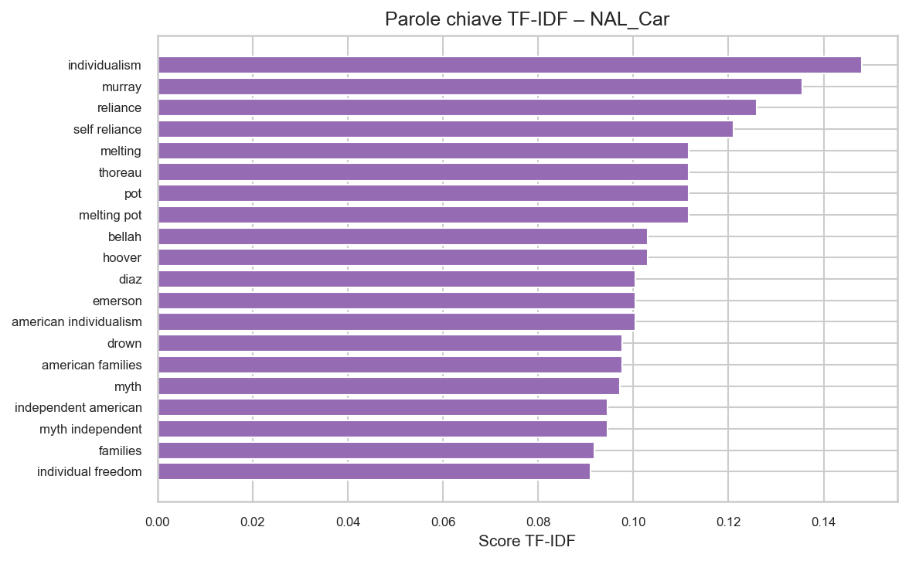
*individualism guida con punteggio eccezionale (~0.15); murray, reliance, self reliance, melting pot, thoreau, bellah, hoover, diaz, emerson, american individualism, myth, families — un pantheon di autori e concetti dell'individualismo americano che non compaiono altrove nel corpus.*

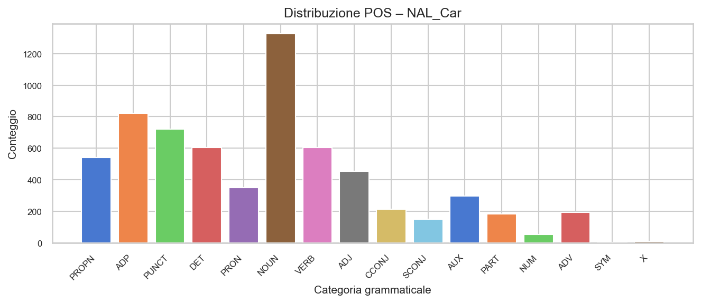
*NOUN (~1.310) domina; ADP (~820) e PUNCT (~730) seguono. ADV (~200) è proporzionalmente tra i più alti, coerente con un registro argomentativo che modifica asserzioni. PROPN (~540) è elevato, riflettendo i numerosi riferimenti ad autori e figure storiche.*

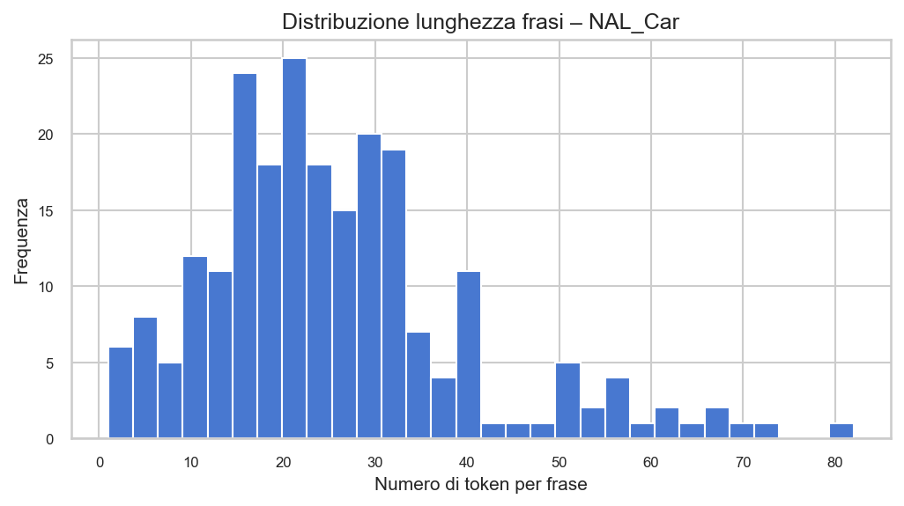
*Distribuzione ampia con picco a 20–22 token e coda estesa fino a ~80 token. La forma è più piatta rispetto alle discipline scientifiche, compatibile con un registro saggistico che alterna frasi concise e costrutti argomentativi elaborati.*

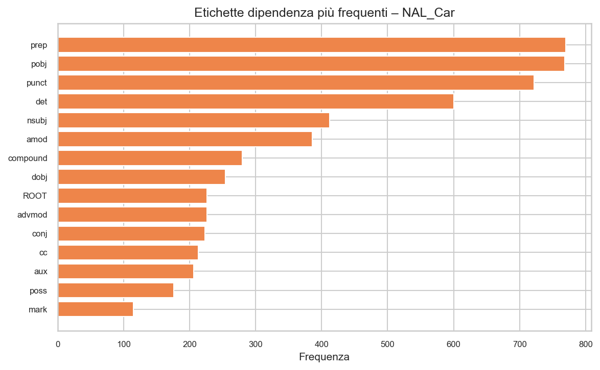
*prep e pobj guidano a parità (~770 ciascuno) — dominanza preposizionale. poss (~180) è tra i valori più alti del corpus, coerente con il discorso sull'identità che usa costruzioni possessive (America's myth, Emerson's vision). mark (~110) segnala frequenti subordinate avverbiali.*

---

## NAL_DiL

NAL_DiL è la disciplina di letteratura afroamericana. Le keyword TF-IDF — *mercy*, *master*, *harriet*, *jacobs*, *irene*, *wheatley*, *jacob*, *girl*, *toni* — sono stabili. Rispetto alla prima versione, *ah* scende dalla terza posizione e compare *excerpted*, segnale che il preprocessing ha ora catturato un'intestazione o un'indicazione di fonte nei testi. Le frequenze mostrano *passage* (39), *white* (35), *black* (29): *unclear* scompare dalla top 10, e con esso il segnale più diretto di risposte incomplete. Compaiono invece *read* (19) e *pride* (19), termini di analisi letteraria.

Morfologicamente, TTR a 0.116 su 1.036 lemmi unici. La percentuale di sostantivi (NOUN 17.2%) rimane la più bassa del corpus, e la percentuale di verbi (VERB 10.8%) la più alta — profilo narrativo confermato. La densità di nominalizzazioni è la più bassa del corpus (2.00/100 token). Le formule accademiche sono quasi assenti (3 totali, 0.39/1000 token).

Sintatticamente, frasi a 22.41 token/frase con subordinazione 1.62 e profondità 7.00 — valori in aumento rispetto alla prima versione (21.27, 1.44, 6.68), suggerendo che con il preprocessing aggiornato i testi risultano sintatticamente più complessi. La coesione (58 marcatori, 16.43/100 frasi) mostra *first* (13), *because* (13) e *then* (11) come marcatori principali — struttura narrativa e analitica per sequenze. Il topic dominante è T5 con copertura totale (6/6 documenti) — cambiamento rispetto al T3 della prima versione. L'agency conferma i valori anomali: Concept% al 27.7% (la più bassa del corpus), "Other" al 44.8% (la più alta). Il passivo è il secondo più basso del corpus (9.5%).

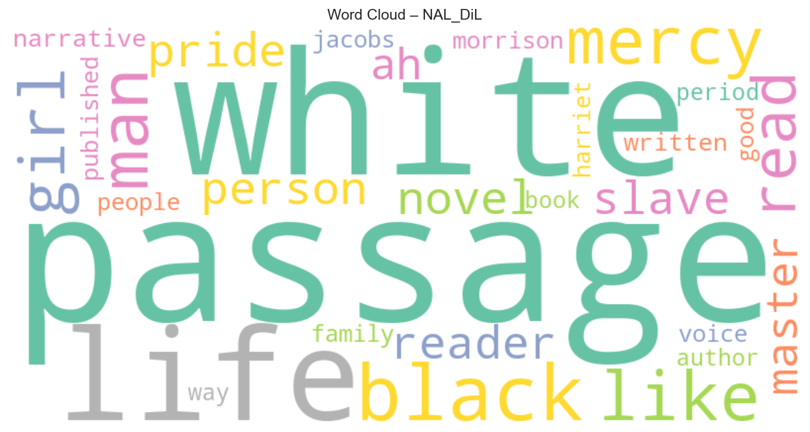
*passage è il termine più grande; white e life seguono. black, master, slave, mercy, girl, read, novel, person, pride, harriet, morrison, jacobs formano il campo semantico della narrativa afroamericana schiavista e post-schiavista. Il cloud ha il profilo lessicale più letterario del corpus.*

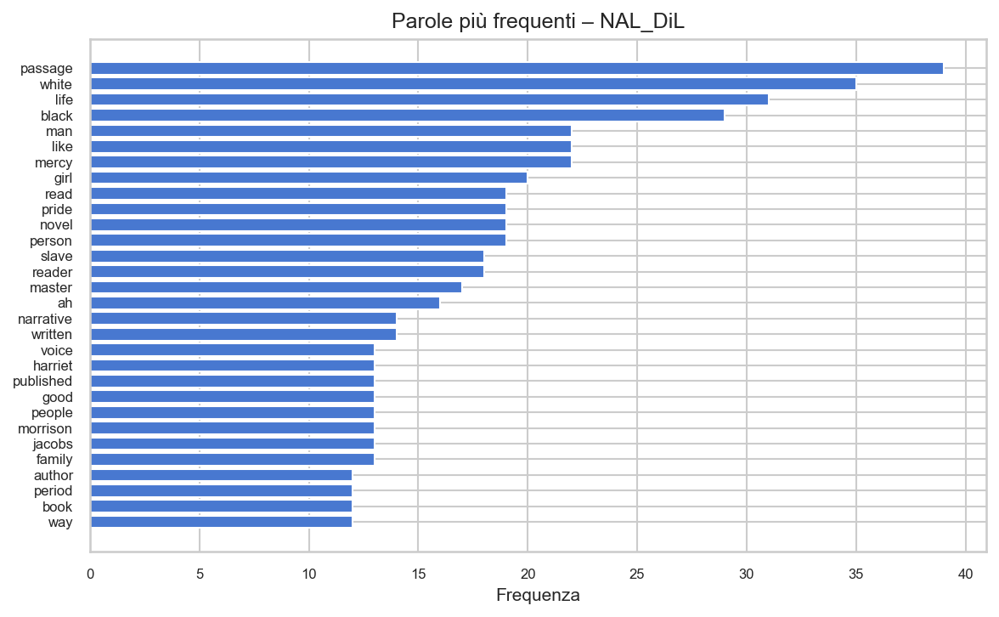
*passage (~39) guida — inusuale come termine di testa, riflettendo probabilmente un'intestazione ricorrente nei materiali didattici. white (~35) e life (~31) seguono; black (~29), man (~22), mercy (~22), girl (~20) completano il profilo tematico.*

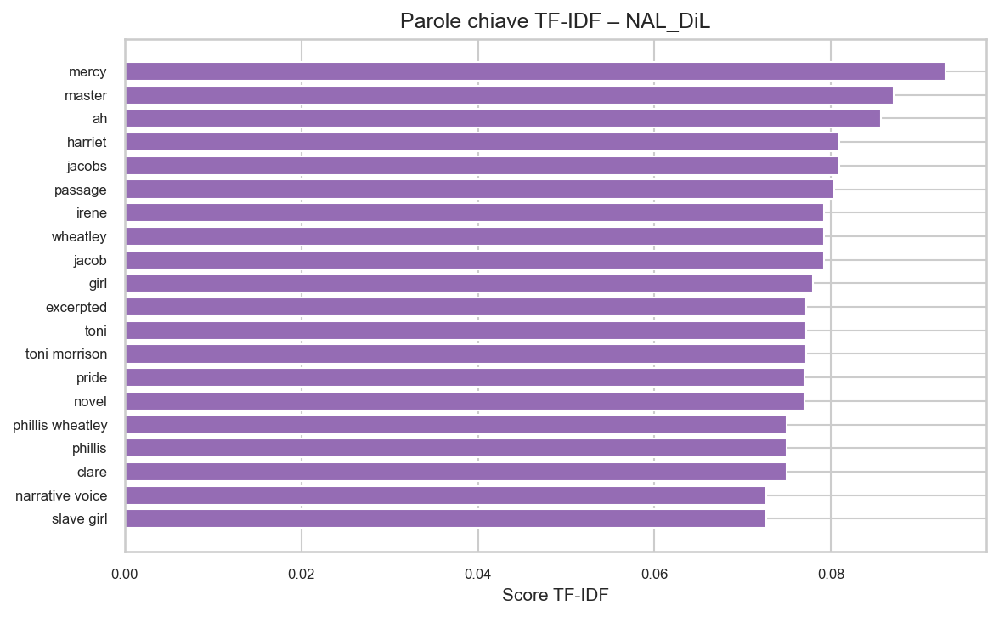
*mercy, master, ah, harriet, jacobs, irene, wheatley, passage, jacob, girl, excerpted, toni morrison, pride, phillis wheatley, slave girl, narrative voice — termini legati a testi specifici del canone afroamericano (Morrison, Jacobs, Wheatley) con alta esclusività rispetto al corpus.*

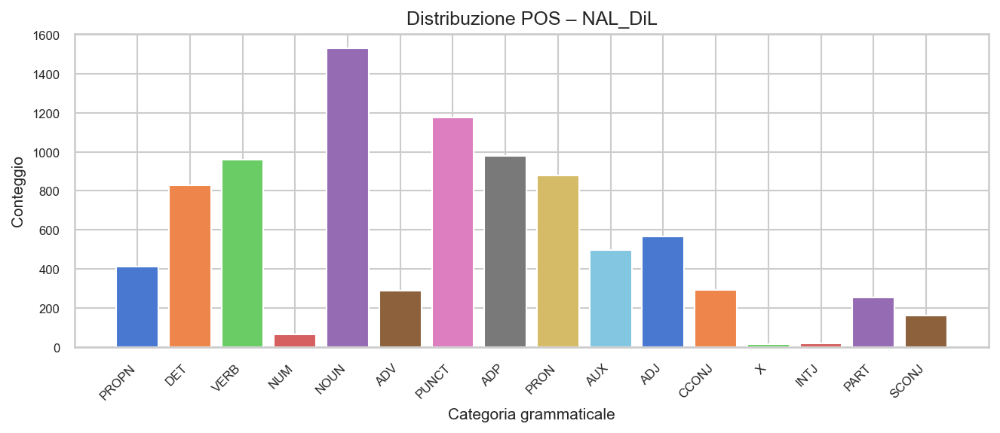
*NOUN (~1.540) domina ma con divario minore rispetto alle discipline accademiche; VERB (~965) è proporzionalmente il più alto del corpus (10.8%), compatibile con un registro narrativo. PRON (~880) è molto elevato — il più alto in proporzione — riflettendo la prosa finzionale in prima e terza persona.*

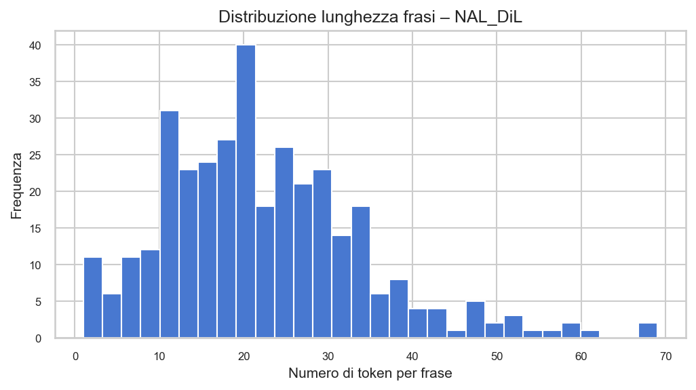
*Distribuzione con doppio picco: uno attorno a 10–12 token e uno a 20–22 token. La coda si estende fino a ~70 token. Il profilo bimodale suggerisce la coesistenza di frasi brevi di analisi letteraria e costrutti più ampi di riassunto narrativo.*

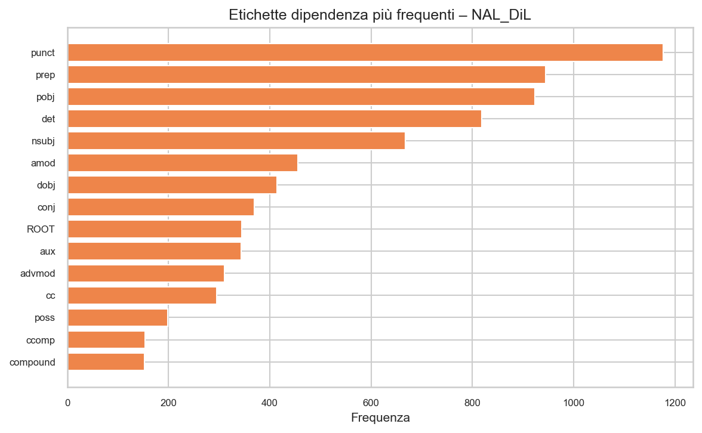
*punct (~1.170) guida, seguito da prep e pobj (~940/920). poss (~195) e ccomp (~155) sono relativamente elevati, segnalando costruzioni possessive (the slave's voice, Harriet's narrative) e subordinate completive tipiche dell'analisi testuale.*

---

## SCSA_Bon

SCSA_Bon è il corpus più grande (52 documenti) e più omogeneo tematicamente. Le keyword TF-IDF — *band gap*, *bioconjugation*, *polymers*, *semiconductor*, *conductivity*, *solar*, *pd*, *palladium* — sono stabili, con *palladium* che sostituisce *nm* rispetto alla prima versione, riflettendo una maggiore sensibilità del preprocessing ai nomi chimici. Le frequenze confermano *reaction* (418), *band* (331), *gap* (186), *material* (175). Rispetto alla prima versione, *unclear* (253) e le forme del metaregistro scompaiono dalla top 10, lasciando emergere termini di contenuto come *catalyst* (160) e *describe* (152) — quest'ultimo un residuo delle consegne d'esame che ora risulta visibile.

Morfologicamente, TTR a 0.053 su 2.316 lemmi unici. La percentuale di sostantivi è 24.7% — la seconda più alta del corpus — con avverbi al 2.4% (tra i più bassi). Le nominalizzazioni sono 1.982 (5.27/100 token), con *reaction* (411) e *bioconjugation* (144) dominanti e *-tion* schiacciante (1.296 occorrenze).

Sintatticamente, le frasi sono tra le più brevi (18.35 token/frase) con la subordinazione più bassa del corpus (0.97, pari a EOK_Geu) e profondità 6.34. La coesione (326 marcatori, 15.52/100 frasi) ha il diversità index più basso del corpus (0.055): *also* (147) e *because* (74) coprono da soli la quasi totalità dei marcatori. Le formule accademiche (89 totali, 2.40/1000 token) hanno *for example* (46) come formula dominante — inusuale rispetto alla prima versione dove *in order to* era più frequente.

Il topic dominante è T6 con copertura totale (52/52 documenti) — cambiamento rispetto alla prima versione, dove la disciplina era bipartita tra T0 e T2. Questa unificazione in un unico topic suggerisce che il modello LDA in questa versione ha integrato le due sotto-aree (semiconduttori e bioconjugation) in un cluster chimico unificato. L'agency mostra AuthorID al 10.5% (tra i più alti del corpus) e passivo al 12.7%.

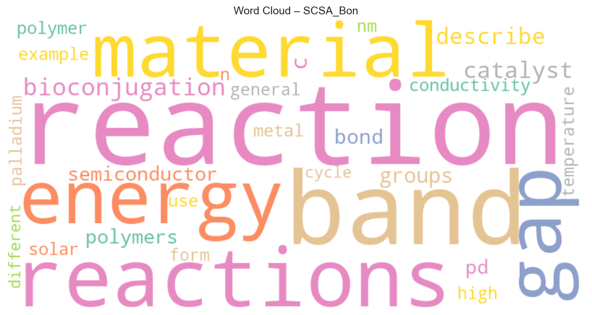
*reaction e band dominano il centro; material, reactions, energy, bioconjugation, gap, polymer, describe, catalyst, semiconductor, conductivity formano i due poli chimici della disciplina: chimica dei materiali (band gap, semiconductor, solar) e chimica bioorganica (bioconjugation, palladium, amine). Il cloud è il più omogeneo del corpus per coesione tematica.*

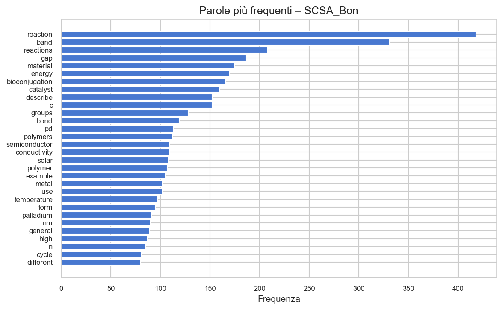
*reaction (~420) guida con il margine più ampio nel corpus; band (~330), material (~175), reactions e bioconjugation seguono. La distribuzione è molto ripida nella parte alta e poi decrescente — profilo tipico di un corpus altamente specializzato con lessico tecnico ricorrente.*

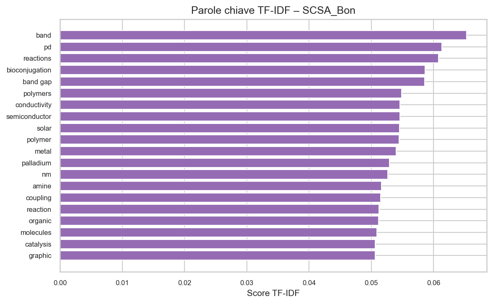
*band, pd, reactions, bioconjugation, band gap, polymers, conductivity, semiconductor, solar, palladium, nm, amine, coupling, catalysis, graphic — il vocabolario chimico-fisico più compatto del corpus. I punteggi TF-IDF sono relativamente bassi in assoluto (max ~0.065), riflettendo la distribuzione del lessico tecnico su molti documenti simili.*

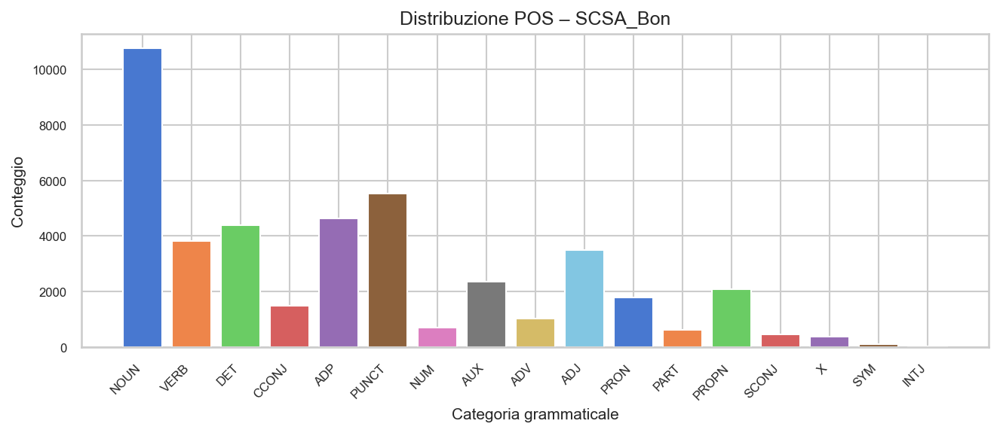
*NOUN (~10.700) è il valore assoluto più alto del corpus; il rapporto NOUN/VERB è il più sbilanciato (≈2.8:1), compatibile con la prosa scientifica descrittiva. NUM (~1.050) è il più alto in assoluto, riflettendo la densità di valori numerici tipica degli elaborati di chimica.*

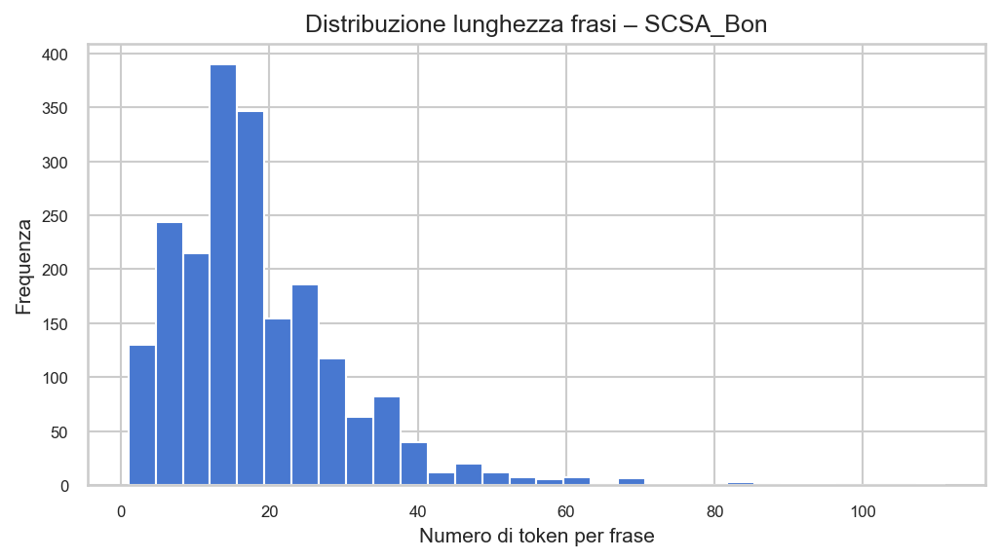
*Picco acuto a 12–15 token con coda che declina rapidamente. Il profilo è il più stretto e spostato a sinistra tra le discipline con corpus ampi, confermando la sintassi paratattica e poco subordinata (media 18.35 token, subordinazione 0.97).*

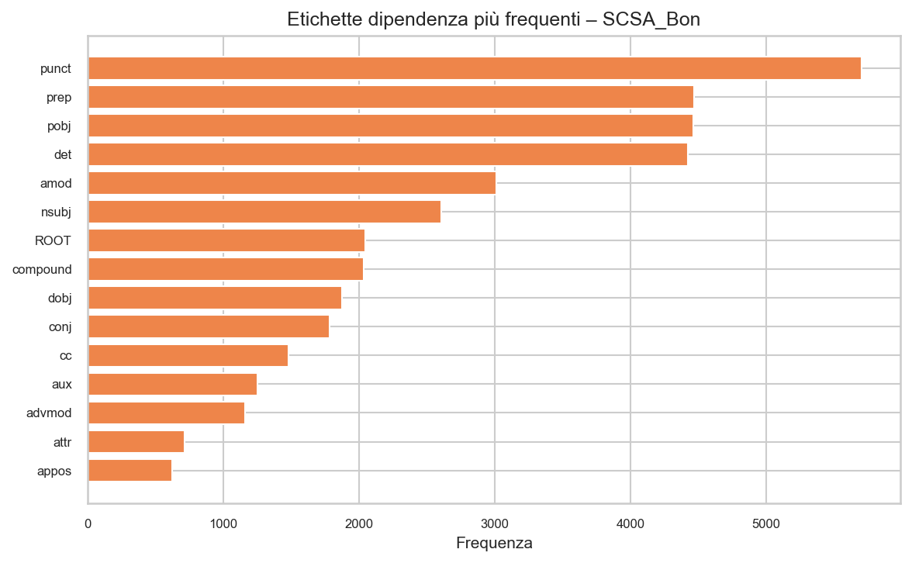
*punct (~5.450) guida; prep, pobj e det sono quasi identici (~4.450 ciascuno) — schema altamente nominale. compound (~2.000) è il più alto del corpus in assoluto, riflettendo i numerosi nomi composti chimici (band gap, solar cell, amine group). nsubj (~2.610) indica frasi predicative frequenti malgrado la brevità.*

---

## Nota trasversale: analisi verbale

### Assenza dei verbi di citazione

Come nella prima versione, i verbi di citazione (*argue*, *claim*, *suggest*, *state*, ecc.) sono assenti in tutte e 12 le discipline. Questo dato si conferma stabile tra le due versioni del preprocessing e costituisce un marcatore diagnostico robusto della natura del corpus: produzioni studentesche in risposta a consegne d'esame, non testi accademici che integrano la letteratura secondaria in modo esplicito.

### Voce passiva

La distribuzione del passivo è sostanzialmente stabile tra le due versioni: EOK_Geu rimane la disciplina con il passivo più basso (8.4%), DEIC_San con il più alto (15.4%). Le discipline scientifiche (SCSA_Bon 12.7%, AS_Gus 14.4%) mantengono valori medio-alti, e le discipline umanistico-letterarie (NAL_DiL 9.5%, NAL_Car 10.8%) i valori più bassi tra le grandi discipline.

### Modalità

I pattern modali sono stabili. SCSA_Bon e CILE_Pol mantengono i profili modali più ricchi in termini assoluti. CPH_Mor conferma la quota epistemica più bassa (106/3.532, 3.0%) e quella di obbligo minima (12, 0.3%), coerente con un discorso storico fattuale. NAL_Car mantiene la quota di obbligo proporzionalmente più alta tra le discipline umanistiche (17/901, 1.9%), compatibile con un discorso normativo sull'identità americana. L'assenza generalizzata di modali di obbligo conferma che i testi studenteschi evitano il registro prescrittivo, preferendo la descrizione alla prescrizione.

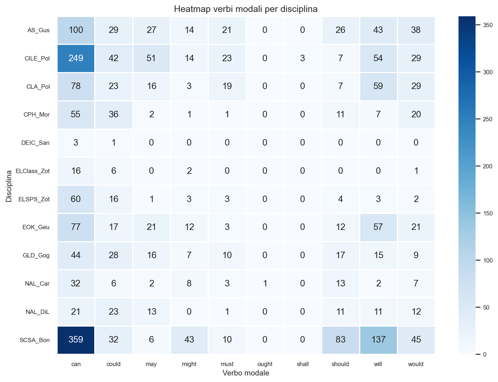
*La heatmap mostra la distribuzione dei verbi modali per disciplina. CILE_Pol domina su can (249), compatibile con il discorso sulle facoltà giuridiche. SCSA_Bon ha i valori più alti di should (83) e must (137), segnalando raccomandazioni metodologiche e prescrizioni scientifiche. AS_Gus ha il profilo modale più ricco in termini di diversità (can, may, will, would, should, must tutti presenti). DEIC_San è la riga quasi vuota — documento singolo con pochissimi modali in assoluto.*

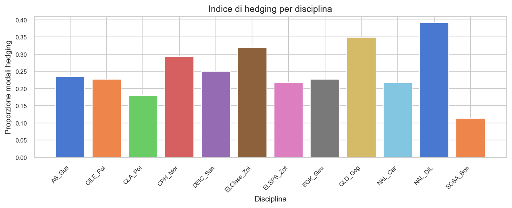
*NAL_DiL ha l'indice di hedging più basso (~0.11) — il registro narrativo non richiede modulazione epistemica. GLD_Gog (~0.35) e NAL_Car (~0.39) sono ai livelli più alti, compatibili con discipline che argomentano posizioni su fenomeni complessi. CLA_Pol (~0.18) è tra i più bassi nonostante il registro normativo, suggerendo un discorso che afferma più che qualifica.*

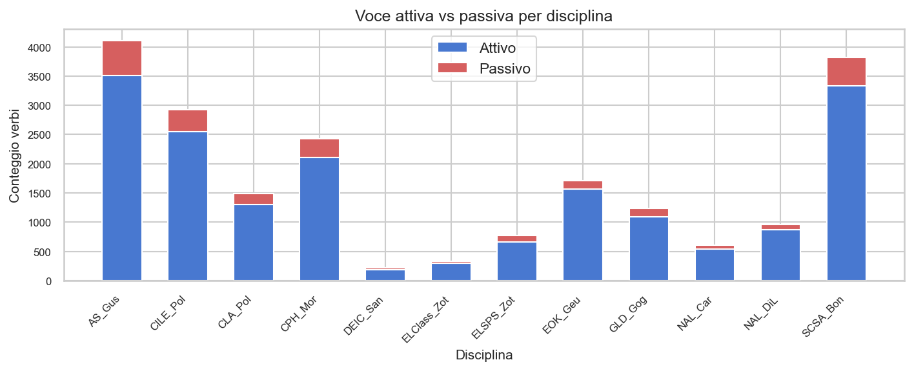
*AS_Gus e SCSA_Bon sono i corpus più grandi in volume verbale assoluto. La proporzione di rosso (passivo) è visivamente simile tra le discipline, ma EOK_Geu mostra la striscia passiva proporzionalmente più sottile — confermando il valore più basso del corpus (8.4%). DEIC_San è la barra più piccola, riflettendo il volume ridotto del documento singolo.*

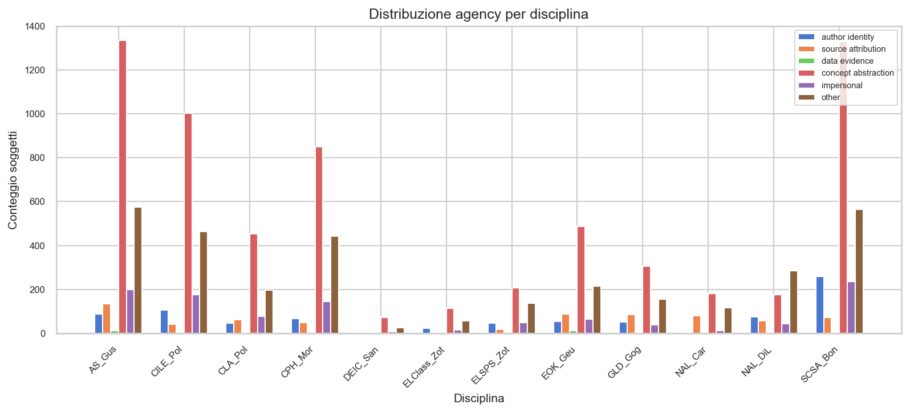
*SCSA_Bon ha la barra "concept abstraction" più alta in assoluto; GLD_Gog e NAL_Car hanno i valori più alti di source attribution (barra verde). La barra "other" di NAL_DiL è proporzionalmente la più alta del corpus, coerente con soggetti narrativi non classificabili nelle categorie accademiche standard.*

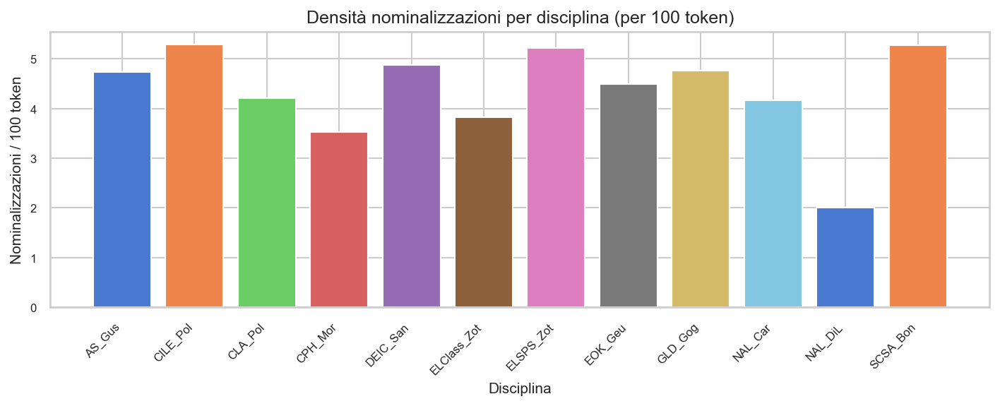
*NAL_DiL è nettamente il valore più basso (~2.0/100 token), separato da tutte le altre discipline. CILE_Pol, ELSPS_Zot e SCSA_Bon formano il cluster con i valori più alti (~5.3), indicando prosa accademica altamente nominalizzata. CPH_Mor (~3.5) è il secondo valore più basso tra le discipline non letterarie.*

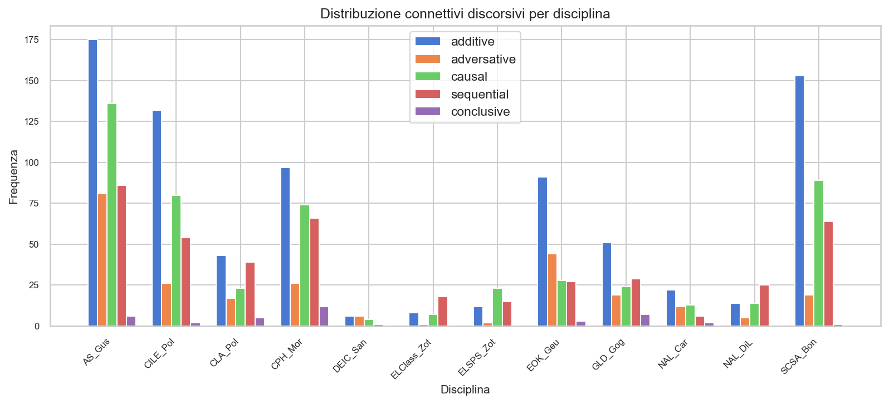
*AS_Gus e SCSA_Bon hanno i valori assoluti più alti di additive markers (blu), dominati da also. CPH_Mor mostra la componente causale (verde) più prominente. DEIC_San e GLD_Gog hanno le distribuzioni più equilibrate tra le categorie. Le discipline Zot hanno valori assoluti bassi per via del volume ridotto.*

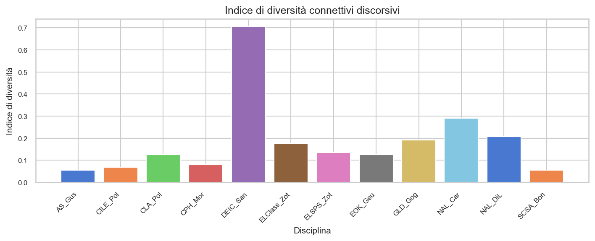
*DEIC_San ha il valore eccezionalmente alto (~0.70) — paradossale dato il corpus ridotto, indica un repertorio di connettivi proporzionalmente variegato rispetto al totale. SCSA_Bon (~0.05) e AS_Gus (~0.06) sono i più bassi, confermando che entrambe le discipline usano pochi connettivi e sempre gli stessi (also, because). NAL_Car (~0.29) è il valore più alto tra le grandi discipline.*

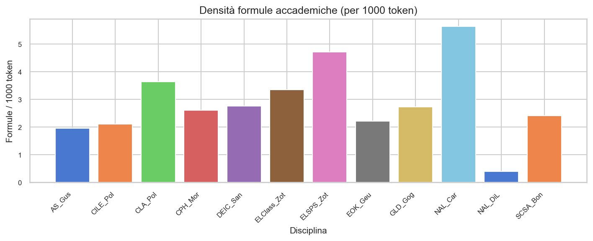
*NAL_Car (~5.6/1000 token) ha la densità più alta del corpus, seguito da ELSPS_Zot (~4.7). NAL_DiL (~0.4) è il valore più basso — le formule accademiche sono quasi assenti nel registro narrativo-letterario. Le due discipline Zot si posizionano tra le più alte, compatibile con un discorso metalinguistico che argomenta per definizioni ed esempi.*

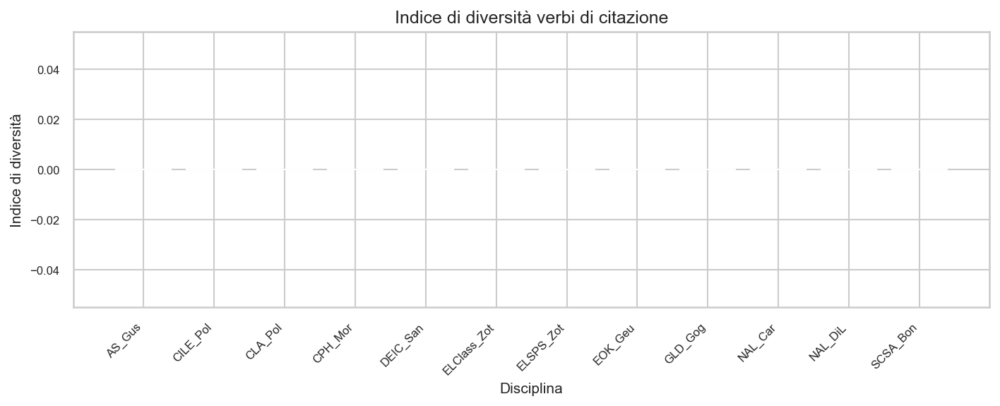
*Il grafico è piatto a zero per tutte le 12 discipline — conferma visiva dell'assenza totale di verbi di citazione nell'intero corpus. Questo è il dato diagnostico più netto dell'analisi: nessuna disciplina produce testi che integrino la letteratura secondaria con verbi di attribuzione esplicita.*